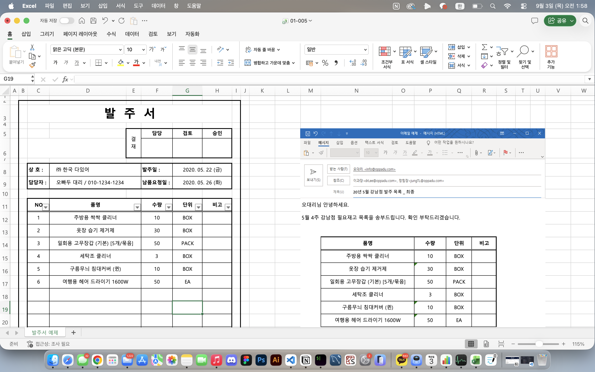
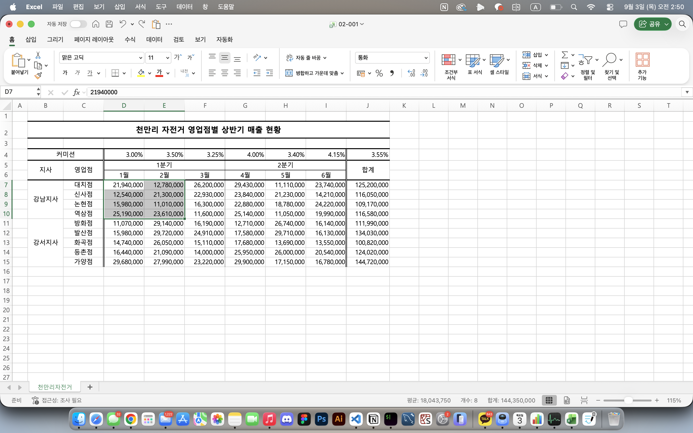
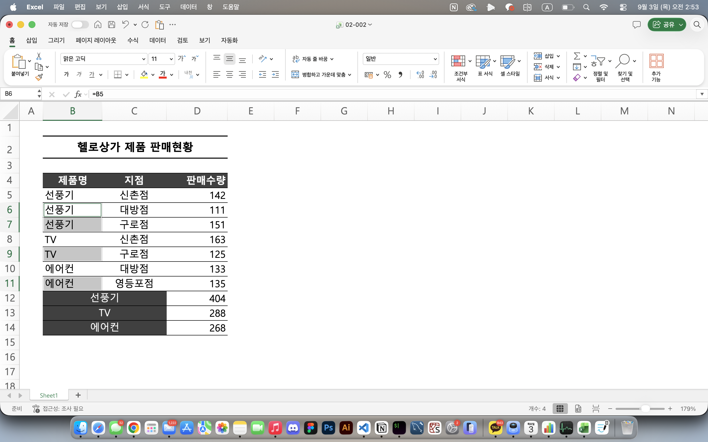
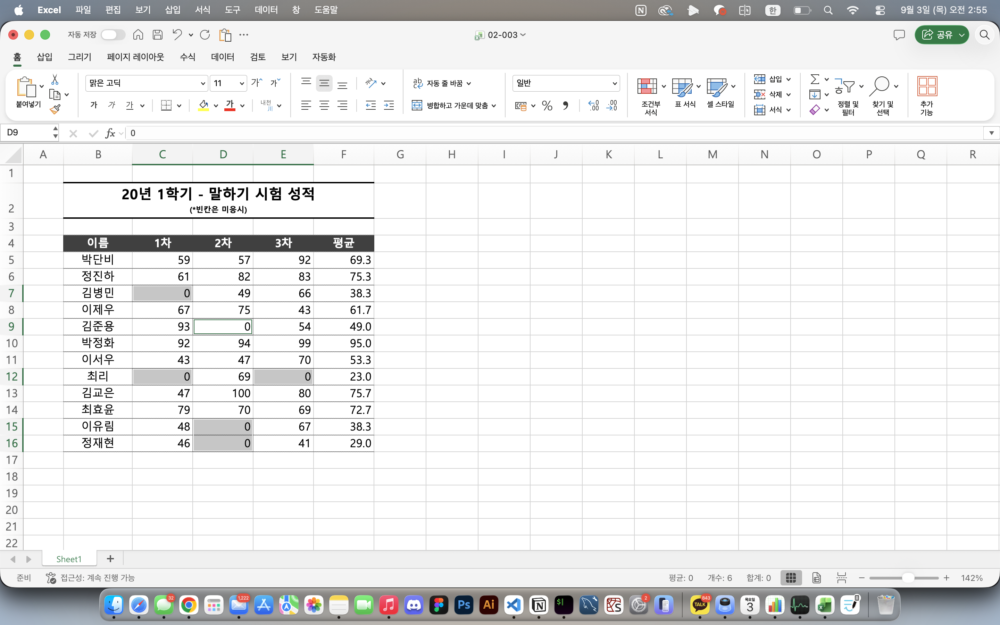
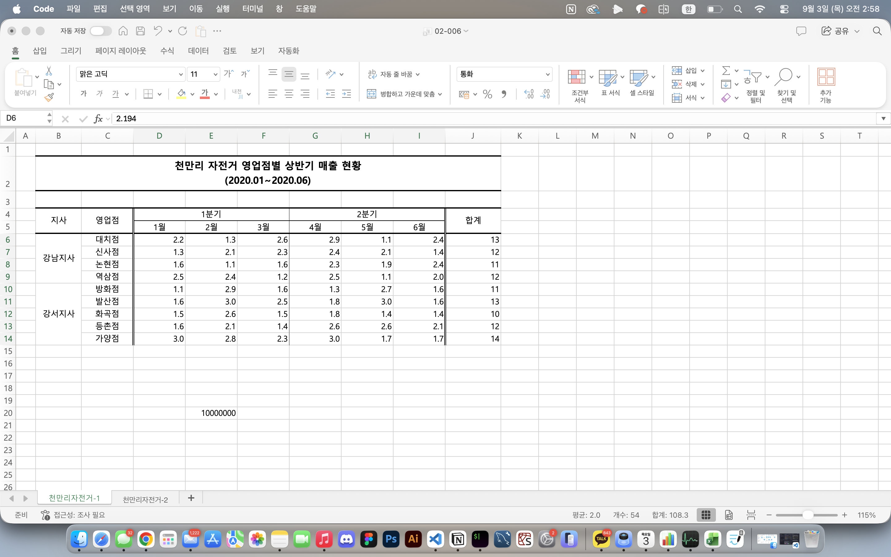

# Excel 1주차 정규 과제 

📌Excel 정규과제는 매주 정해진 분량의 『*진짜 쓰는 실무 엑셀*』 을 읽고 학습하는 것입니다. 이번주는 아래의 **EXCEL_1st_TIL**에 나열된 분량을 읽고 공부하시면 됩니다.

아래의 문제를 풀어보며 학습 내용을 점검하세요. 문제를 해결하는 과정에서 개념을 스스로 정리하고, 필요한 경우 제시된 강의를 참고하여 보완하는 것이 좋습니다.

**교재 실습 예제 파일은 1주차 과제 설명 노션에 있습니다. 해당 파일을 다운 후 실습 진행해주시면 됩니다.**

**👀(수행 인증샷은 필수입니다.)** 

## EXCEL_1st_TIL

### 1장 시작부터 남다른 실무자의 엑셀 활용
#### 01. 엑셀 기본 설정 변경으로 맞춤 환경 만들기 (범위 제외)
#### 02. 엑셀 좀 사용하려면 반드시 알아야 할 엑셀 기본키 (범위 제외)
#### 03. 엑셀의 기본 동작 원리 이해하기
#### 04. 엑셀에서 발생하는 모든 오류와 해결 방법 총정리
#### 05. 실무자면 꼭 알아야 할, 필수 단축키 모음

### 2장 실무자라면 반드시 알아야 할 엑셀 활용
#### 01. 보기 좋은 표, 활용할 수 있는 데이터를 위한 필수 상식
#### 02. 편리한 엑셀 문서 작업을 위한 실력 다지기
#### 03. 엑셀로 시작하는 기초 데이터 분석
#### 02. 엑셀 데이터 가공을 위한 텍스트 나누고 합치기

## Study Schedule

| 주차  | 공부 범위     | 완료 여부 |
| ----- | ------------- | --------- |
| 1주차 | p.22~111    | ✅         |
| 2주차 | p.112~157   | 🍽️         |
| 3주차 | p.158~213  | 🍽️         |
| 4주차 | p.214~273 | 🍽️         |
| 5주차 | p.274~339 | 🍽️         |
| 6주차 | p.340~425 | 🍽️         |
| 7주차 | p.426~472 | 🍽️         |

 

<!-- 여기까진 그대로 둬 주세요-->

---

# 1️⃣ 학습 내용 정리

## 01-3. 엑셀의 기본 동작 원리 이해하기
> **셀 참조 방식에 대해 정리해주세요.**   

### ✅ **`상대참조`**   
: 셀 주소앞에 $ 기호가 전혀 포함되지 않음  &nbsp;&nbsp;&nbsp;*ex) A3*
### ✅ **`절대참조`**   
: 열, 행에 모두 기호를 붙이 형태  &nbsp;&nbsp;&nbsp;*ex) $A$3*  
- 수식복수, 자동 채우기 실행해도 셀 주소는 고정됨
### ✅ **`혼합참조`**   
: 열, 행 중 하나만 선택하여 고정  &nbsp;&nbsp;&nbsp;*ex) A$3*  
  
 

## 01-4. 엑셀에서 발생하는 모든 오류와 해결 방법 총정리
> **숫자처럼 보이는 문자를 빠르게 확인하고 해결하기(51 ~52p)를 진행 후 인증사진을 첨부해주세요.**  

  
 

## 01-5. 실무자면 꼭 알아야 할, 필수 단축키 모음
> **이번에 배운 단축키에 대해 정리해주세요.**
- `Alt`: 리본메뉴에 기능별 단축키 표시
- `ctrl + Pageup` or `ctrl + Pagedown`: 각각 이전시트, 다음시트로 이동
- `alt > P > R > S` : 인쇄영역 설정
- **`shift + F10`**: 마우스 우클릭 메뉴
- `ctrl + shift + U` : 수식 입력줄 확장
- `alt > W > F > F` : 틀고정
- `ctrl + shift + L` : 범위정렬 or 범위에서 원하는 값만 필터링
    - `alt + L` : 자동필터 적용
    - `alt + ↓` : 필터 옵션 활성화
- `ctrl + \` : 기준 행과 다른 값 선택
- `ctrl + shift + \` : 기준 열과 다른 값 선택
- **`ctrl + [`** : 현재 셀의 수식에 참조되는 셀(사용한 셀)
- **`ctrl + ]`** : 현재 셀을 참조하는 셀(사용된 셀)
- **`ctrl + alt + V`** : 선택하여 붙여넣기
- **`ctrl + F`** : 찾기
- `ctrl + enter` : 범위 선택 상태에서 값이나 수식 입력후 `ctrl + enter`입력시 동일한 값 입력됨
    - 자동채우기와 달리 떨어진 범위도 한번에 입력 가능함!
- `ctrl + shift + 7` : 선택한 범위 바깥쪽에만 테두리 적용
- `ctrl + Backspace` : 현재 활성화 된 셀 확인

> ### ➕ *특정 서식 빠르게 적용*  
> | 단축키 | 적용 서식 |
> |---|---|
> | `Ctrl + Shift + '` | 일반 서식 (예: 1000) |
> | `Ctrl + Shift + 1` (`!`) | 숫자 서식 (예: 1000 → 1,000) |
> | `Ctrl + Shift + 2` (`@`) | 시간 서식 (예: 08:30, 09:15) |
> | `Ctrl + Shift + 3` (`#`) | 날짜 서식 (예: 2020-03-09) |
> | `Ctrl + Shift + 4` (`$`) | 통화 서식 (예: 1000 → ₩1,000) |
> | `Ctrl + Shift + 5` (`%`) | 백분율 서식 (예: 0.1 → 10%) |
> | `Ctrl + Shift + 6` (`^`) | 지수 서식 (예: 1000 → 1.00E+03) |

  
 

## 02-1. 보기 좋은 표, 활용할 수 있는 데이터를 위한 필수 상식
> **데이터와 표를 비교해주세요**
### 🚨 데이터를 정렬하거나 특정 값을 찾아야 할 때
- 표 형태 : 정렬, 최댓값·최솟값 찾을 때 문제 발생
- 데이터 형태 : 정렬 기능으로 손 쉽게 원하는 결과 찾을 수 있음
### 🚨 새로운 데이터가 누적될 때
- 표 형태 : 이후의 관리가 어려워 짐 *(표에 빈칸 발생)*
### 🚨 새로운 구분자를 추가할 때
- 표 형태 : 구분자의 추가 위치에 따라 표의 전반적인 레이아웃을 다시 수정하는 작업 필요

> **셀 병합 기능을 자제해야 하는 이유를 정리해주세요.**
### ⚠️ 셀 병합으로 인해 발생하는 문제점
1. **범위 선택이 제한**됨
2. 범위의 **수정/편집이 제한**됨
3. **표 기능과 피벗 테이블 사용**이 제한됨
4. **자동 채우기**를 제대로 활용할 수 없음
5. **데이터 정렬 기능**을 사용할 수 없음
6. 함수 사용시 **옳지 않은 결과** 반환 가능

  
 

## 02-2. 편리한 엑셀 문서 작업을 위한 실력 다지기
> **셀 병합하지 않고 가운데 정렬하기(75 ~77p)를 진행 후 인증사진을 첨부해주세요.**

> **셀 병합 해제 후 빈칸 쉽게 체우기(78 ~79p)를 진행 후 인증사진을 첨부해주세요.**

> **빈 셀을 한 번에 찾고 내용 입력하기(80 ~81p)를 진행 후 인증사진을 첨부해주세요.**

> **숫자 데이터의 기본 단위를 한 번에 바꾸는 방법(84 ~87p)를 진행 후 인증사진을 첨부해주세요.**

 
 

## 02-3. 엑셀로 시작하는 기초 데이터 분석
> **행/열 전환하여 새로운 관점으로 데이터 살펴보기(88 ~90p)를 진행 후 인증사진을 첨부해주세요.**
<!-- 이 부분을 지우고 인증사진을 제출해주세요.-->

> **중복된 데이터 입력 제한하기(90 ~92p)를 진행 후 인증사진을 첨부해주세요.**
<!-- 이 부분을 지우고 인증사진을 제출해주세요.-->

## 02-4. 엑셀 데이터 가공을 위한 텍스트 나누고 합치기
> **여러 줄을 한 줄로 합치거나 한 줄을 여러 줄로 분리하기(104 ~107p)를 진행 후 인증사진을 첨부해주세요.**
<!-- 이 부분을 지우고 인증사진을 제출해주세요.-->

> **여러 열에 입력된 내용을 간단하게 한 열로 합치기(108 ~109p)를 진행 후 인증사진을 첨부해주세요.**
<!-- 이 부분을 지우고 인증사진을 제출해주세요.-->

---

### 🎉 수고하셨습니다.

