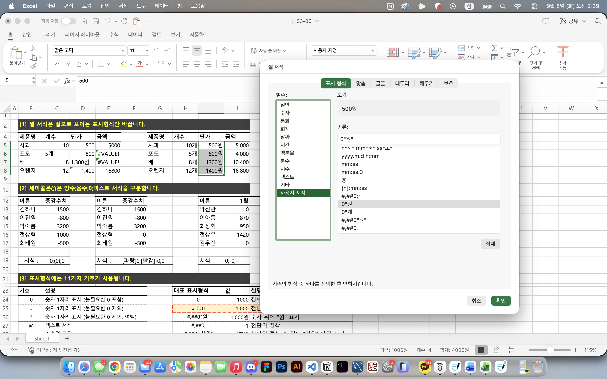
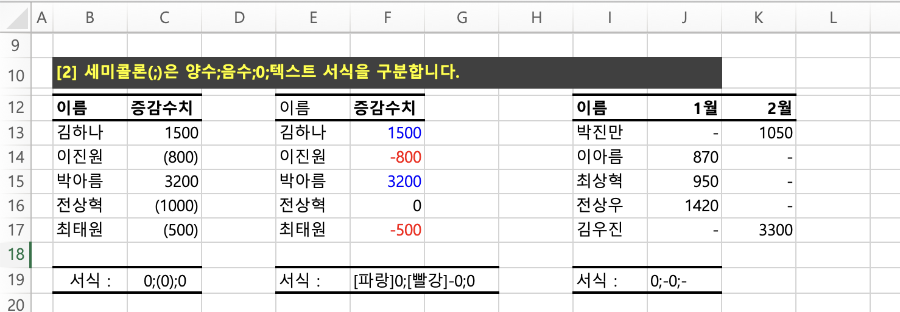
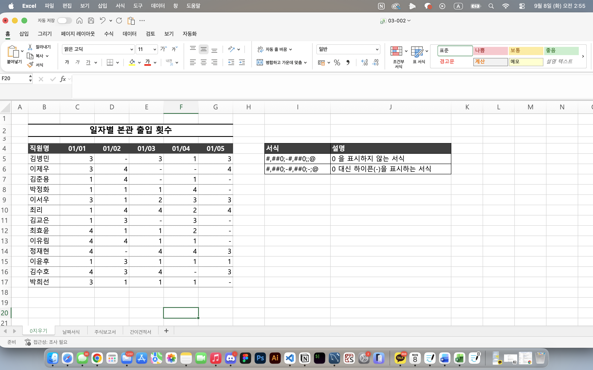
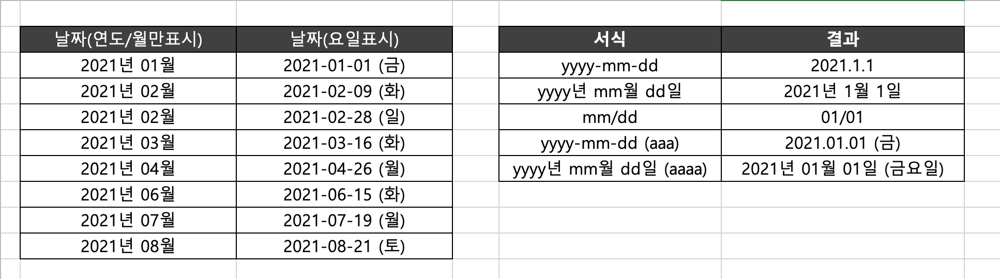
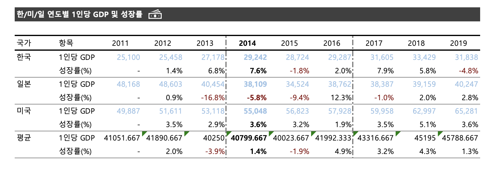
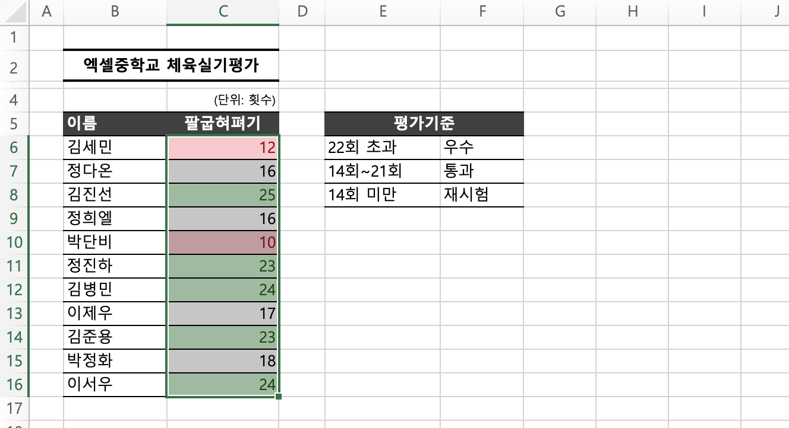
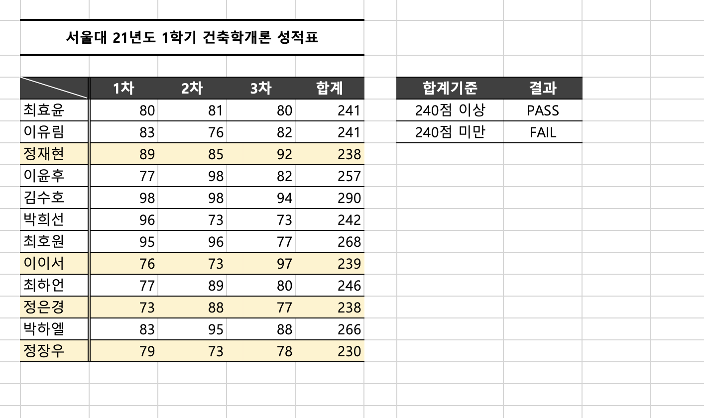
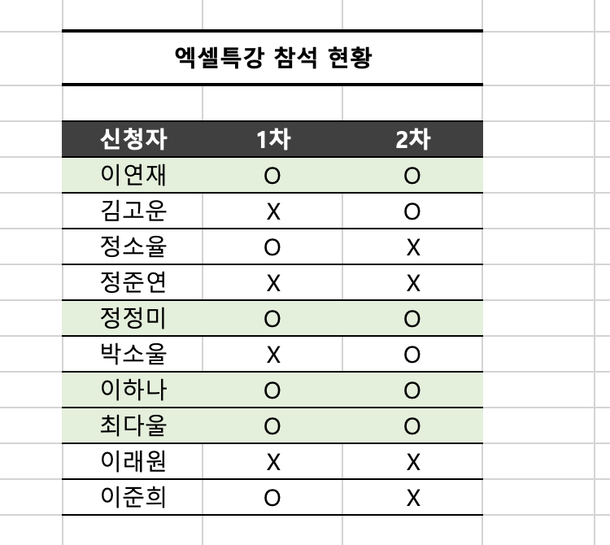

# Excel 2주차 정규 과제 

📌Excel 정규과제는 매주 정해진 분량의 『*진짜 쓰는 실무 엑셀*』 을 읽고 학습하는 것입니다. 이번주는 아래의 **EXCEL_2nd_TIL**에 나열된 분량을 읽고 공부하시면 됩니다.

아래의 문제를 풀어보며 학습 내용을 점검하세요. 문제를 해결하는 과정에서 개념을 스스로 정리하고, 필요한 경우 제시된 강의를 참고하여 보완하는 것이 좋습니다.

**교재 실습 예제 파일은 1주차 과제 설명 노션에 있습니다. 해당 파일을 다운 후 실습 진행해주시면 됩니다.**

**👀(수행 인증샷은 필수입니다.)** 

## EXCEL_2nd_TIL

### 3장 보고서가 달라지는 서식 활용법
#### 01. 반드시 숙지해야 할 셀 서식 기초
#### 02. 실무자를 위한 셀 표시 형식 대표 예제
#### 03. 깔끔한 보고서 작성을 위한 기본 규칙
#### 04. 조건부 서식으로 빠르게 데이터 분석하기
#### 05. 데이터 이해를 돕는 시각화 요소 추가하기 (범위 제외)


## Study Schedule

| 주차  | 공부 범위     | 완료 여부 |
| ----- | ------------- | --------- |
| 1주차 | p.22~111    | ✅         |
| 2주차 | p.112~157   | ✅         |
| 3주차 | p.158~213  | 🍽️         |
| 4주차 | p.214~273 | 🍽️         |
| 5주차 | p.274~339 | 🍽️         |
| 6주차 | p.340~425 | 🍽️         |
| 7주차 | p.426~472 | 🍽️         |


<br>

<!-- 여기까진 그대로 둬 주세요-->

---

# 1️⃣ 학습 내용 정리

## 03-1. 반드시 숙지해야 할 셀 서식 기초
> **표시 형식은 겉으로 보이는 형식만 바꾼다(113 ~ 115p)를 진행 후 인증사진을 첨부해주세요.**

### `표시 형식` 
: **셀에 저장된 실제 값은 그대로 두고, 화면에 보이는 모양만 바꾸는 기능**
- 단위나 기호를 직접 입력해 문자로 만드는 것보다, 숫자 값은 유지한 채 표시 형식으로 꾸미는 것이 이후 계산이나 정렬에 편리

### ✔️ 주요기호
| 기호 | 의미 |
| --- | --- |
| `0` | 숫자 1자리 표시, 불필요한 0도 표시 |
| `#` | 숫자 1자리 표시, 불필요한 0은 표시하지 않음 |
| `?` | 숫자 1자리 표시, 불필요한 0 대신 여백 표시 |
| `@` | 텍스트 표시 |
| `.` | 소수점 표시 |
| `,` | 천 단위 구분 또는 천 단위 절사 |
| `%` | 백분율 표시 |
| `/` | 소수점 이하를 분수로 표시 |
| `*` | 뒤에 오는 문자를 셀 너비 끝까지 반복 |
| `_` | 뒤에 오는 문자만큼 여백 표시 |
| `[ ]` | 특정 조건 또는 색상 적용 |

### ✔️ 0을 숨기거나 하이픈으로 표시하기
| 표시 형식 | 결과 |
| --- | --- |
| `#,##0;-#,##0;;@` | 양수와 음수는 표시하고, 0은 숨김 |
| `#,##0;-#,##0;-;@` | 0을 `-`로 표시 |



<br>
<br>

> **세미콜론으로 양수, 음수, 0, 텍스트 서식을 구분한다(115 ~ 117p)를 진행 후 인증사진을 첨부해주세요.**

### `사용자 지정 표시 형식`
 : 세미콜론(`;`)을 기준으로 **양수 ; 음수 ; 0 ; 텍스트** 순서로 각각 다른 형식을 지정 가능
 - `@` : 텍스트가 들어갈 위치


<br>
<br>


## 03-2. 실무자를 위한 셀 표시 형식 대표 예제
> **0 지우거나 하이픈[-]으로 표시하기(119 ~121p)를 진행 후 인증사진을 첨부해주세요.**

- 실제 값은 0으로 유지되므로 합계나 평균 계산에는 그대로 사용됨
- ex : 
  - 0 숨기기: `#,##0;-#,##0;;@`
  - 0을 하이픈으로 표시: `#,##0;-#,##0;"-";@`


<br>
<br>

> **날짜를 년/월/일 [요일]로 표시하기(121 ~122p)를 진행 후 인증사진을 첨부해주세요.**

- 주요 기호 : `yyyy`(연도), `m`(월), `d`(일), `aaa/aaaa`(요일)
- ex : `yyyy"년" m"월" d"일" (aaaa)` → `2026년 9월 8일 (화요일)`
- 날짜를 직접 문자로 입력하지 않고 날짜 형식을 유지해야 정렬, 날짜 계산, 필터링을 정상적으로 사용 가능함! 


<br>
<br>

## 03-3. 깔끔한 보고서 작성을 위한 기본 규칙
> **깔끔한 보고서 완성하기(131 ~134p)를 진행 후 인증사진을 첨부해주세요.**

⚠️ 보고서는 화려하게 꾸미는 것보다 **숫자와 항목의 구조가 한눈에 들어오도록 정리하는 것**이 중요!
```
- 숫자는 오른쪽 정렬하고 천 단위 구분 기호를 사용
- 금액, 수량, 비율처럼 단위가 다르면 제목이나 열 머리글에 단위를 명확히 표시
- 상위 항목과 하위 항목은 들여쓰기로 구분해 구조를 쉽게 파악할 수 있게
- 테두리를 많이 사용하기보다 꼭 필요한 구분선만 남기고, 특히 세로선은 최소화
- 제목, 머리글, 합계 등 중요한 부분만 강조하고 같은 성격의 데이터에는 동일한 서식 적용
```
***✅ 정렬, 단위, 들여쓰기, 구분선의 규칙을 통일하는 것**이 깔끔한 보고서를 만드는 핵심*


<br>
<br>

## 03-4. 조건부 서식으로 빠르게 데이터 분석하기
> **특정 값보다 크거나 작을 때 강조하기(137 ~139p)를 진행 후 인증사진을 첨부해주세요.**

### 조건부 서식
: 셀의 값이 특정 조건을 만족할 때만 자동으로 글꼴, 채우기색 등의 서식을 적용하는 기능
- 범위를 선택한 뒤 **`[홈] → [조건부 서식] → [셀 강조 규칙] → [보다 큼/보다 작음]`** 에서 기준값을 설정
- 값이 바뀌면 서식도 자동으로 바뀌기 때문에 매출 목표, 기준 미달 값, 이상치 등을 빠르게 확인할 때 유용


<br>
<br>


> **조건을 만족할 때 전체 행 강조하기(141 ~142p)를 진행 후 인증사진을 첨부해주세요.**

- ex : F열의 값이 `미달`인 행 전체를 강조하려면 `=$F2="미달"`과 같이 작성
- `$F`처럼 **조건을 확인할 열은 고정하고, 행 번호는 상대참조로 둠**


<br>
<br>


> **여러 조건에 모두 만족하는 셀 강조하기(143 ~144p)를 진행 후 인증사진을 첨부해주세요.**

- ex : `=AND($C2>=80,$D2="완료")` → C열이 80 이상이고 D열이 `완료`인 경우에만 서식 적용
- 조건이 많아질수록 수식 자체보다 **절대참조(`$`)와 상대참조를 정확히 설정**


<br>
<br>

---


### 🎉 수고하셨습니다.
