# Excel 5주차 정규 과제 

📌Excel 정규과제는 매주 정해진 분량의 『*진짜 쓰는 실무 엑셀*』 을 읽고 학습하는 것입니다. 이번주는 아래의 **EXCEL_5th_TIL**에 나열된 분량을 읽고 공부하시면 됩니다.

아래의 문제를 풀어보며 학습 내용을 점검하세요. 문제를 해결하는 과정에서 개념을 스스로 정리하고, 필요한 경우 제시된 강의를 참고하여 보완하는 것이 좋습니다.

**교재 실습 예제 파일은 1주차 과제 설명 노션에 있습니다. 해당 파일을 다운 후 실습 진행해주시면 됩니다.**

**👀(수행 인증샷은 필수입니다.)** 

## EXCEL_5th_TIL

### 6장 데이터 자동화 및 분석을 위한 표 & 피벗 레이블
#### 01. 범위가 자동으로 확장되는 엑셀 표 기능
#### 02. 원하는 형태로 재정렬한 피벗 테이블 만들기
#### 03. 피벗 테이블의 값 표시 형식 파악하기
#### 04. 데이터를 빠르게 집계하는 그룹 및 정렬 기능
#### 05. 피벗 테이블의 활용도를 높여 줄 유용한 기능
#### 06. 실시간 데이터 분석을 위한 슬라이서, 시간 표시 막대

## Study Schedule

| 주차  | 공부 범위     | 완료 여부 |
| ----- | ------------- | --------- |
| 1주차 | p.22~111    | ✅         |
| 2주차 | p.112~157   | ✅         |
| 3주차 | p.158~213  | ✅         |
| 4주차 | p.214~273 | ✅         |
| 5주차 | p.274~339 | ✅         |
| 6주차 | p.340~425 | 🍽️         |
| 7주차 | p.426~472 | 🍽️         |

 

<!-- 여기까진 그대로 둬 주세요-->

---

# 1️⃣ 학습 내용 정리

## 06-1. 범위가 자동으로 확장되는 엑셀 표 기능
### 📌 일반 범위와 표의 차이

| 구분 | 일반 범위 | 표 |
| --- | --- | --- |
| 새 데이터 추가 | 수식·서식을 직접 확장해야 함 | 마지막 행 아래에 입력하면 범위가 자동 확장됨 |
| 수식 적용 | 각 셀을 직접 복사해야 함 | 계산 열의 수식이 새 행까지 자동 적용됨 |
| 서식 | 직접 지정 | 표 스타일이 자동 적용됨 |
| 이름 사용 | 이름 정의가 필요함 | 표 이름을 바로 참조 가능함 |
| 참조 방식 | 셀 주소 사용 | 구조적 참조 사용 가능함 |

- 표로 변환하는 단축키는 `Ctrl + T`임
- 표는 새 데이터를 추가하면 범위가 자동으로 확장되는 특징이 있음
- 표 이름은 영문 또는 한글로 지정할 수 있으며 공백은 사용할 수 없음
- 표 범위를 일반 범위로 다시 변경해도 적용된 서식은 유지됨

 

> **범위를 표로 변경하고 이름 지정하기(274 ~276p)를 진행 후 인증사진을 첨부해주세요.**
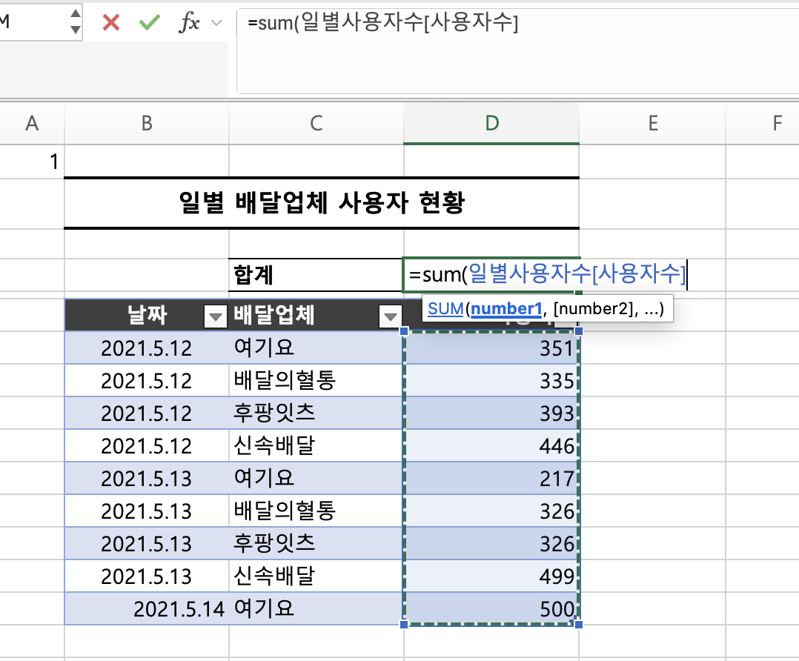
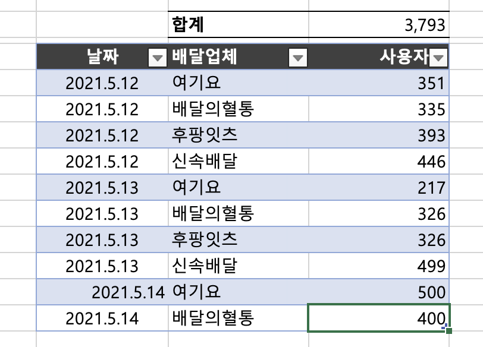
 
 

### ✅ 구조적 참조

표 안의 데이터를 수식에서 참조할 때 셀 주소 대신 **표 이름과 필드명**을 사용하는 방식임

| 구조적 참조 | 의미 |
| --- | --- |
| `표이름[#모두]` | 머리글·데이터·요약 행을 포함한 표 전체 |
| `표이름[#머리글]` | 표의 머리글 영역 |
| `표이름[#데이터]` | 표의 데이터 영역 |
| `표이름[[#데이터],[필드명]]` | 특정 필드의 데이터 영역 |
| `표이름[필드명]` | 특정 필드 전체 |

### 일반 참조와 구조적 참조 비교

| 참조 방식 | 장점 | 단점 |
| --- | --- | --- |
| 일반 참조 | 셀 주소를 직접 지정하므로 익숙하고 간단함 | 데이터가 추가되면 참조 범위를 수정해야 할 수 있음 |
| 구조적 참조 | 데이터 추가 시 참조 범위가 자동으로 확장됨 | 표 기능과 구조적 참조 방식에 익숙해져야 함 |

⚠️ 표 범위에는 병합된 셀이 없어야 하며 머리글은 한 행으로 작성하는 것이 원칙임
 
 
 

## 06-2. 원하는 형태로 재정렬한 피벗 테이블 만들기  

### 📌 피벗 테이블 원본 데이터의 기본 규칙

- 원본 데이터는 **한 행에 하나의 레코드**가 들어가도록 구성함
- 머리글은 반드시 한 줄로 작성함
- 원본 범위 중간에 빈 행·빈 열을 두지 않음
- 같은 열에는 같은 형식의 데이터를 입력함
- 원본 데이터를 표로 지정하면 새 데이터가 추가되어도 피벗 테이블 원본 범위 관리가 편리함

### 피벗 테이블의 4개 영역

| 영역 | 역할 |
| --- | --- |
| 필터 | 보고서 전체를 특정 조건으로 필터링함 |
| 열 | 필드를 가로 방향으로 배치함 |
| 행 | 필드를 세로 방향으로 배치함 |
| 값 | 숫자 데이터를 집계함 |

### ✅ 피벗 테이블 레이아웃

| 레이아웃 | 특징 |
| --- | --- |
| 압축 형식 | 여러 행 필드를 한 열에 계층 형태로 표시함 |
| 개요 형식 | 각 행 필드를 별도 열에 표시하며 그룹 구조가 잘 보임 |
| 테이블 형식 | 각 행 필드를 별도 열에 표시하며 일반 표와 유사한 형태임 |

- `모든 항목 레이블 반복` 기능을 사용하면 각 행에 상위 항목 이름을 반복해서 표시할 수 있음
- `부분합`, `총합계`, `빈 행` 표시 여부를 보고서 목적에 맞게 조정할 수 있음
- 피벗 테이블 스타일을 이용하면 보고서 서식을 빠르게 변경할 수 있음
 

> **피벗 테이블 레이아웃 변경 및 꾸미기(289 ~294p)를 진행 후 인증사진을 첨부해주세요.**
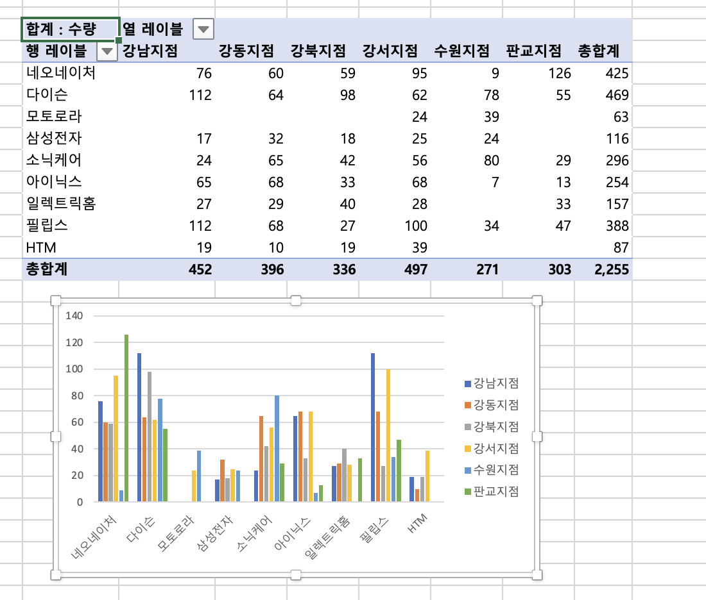
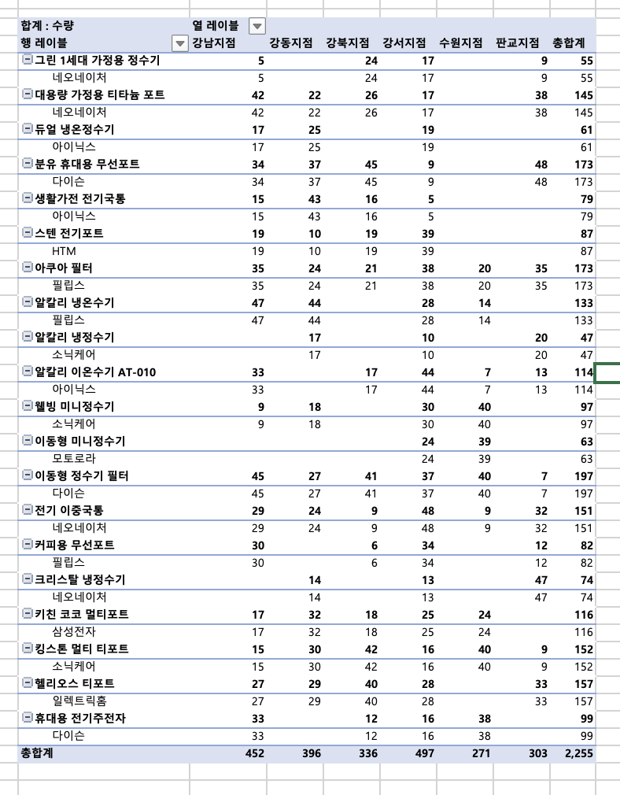
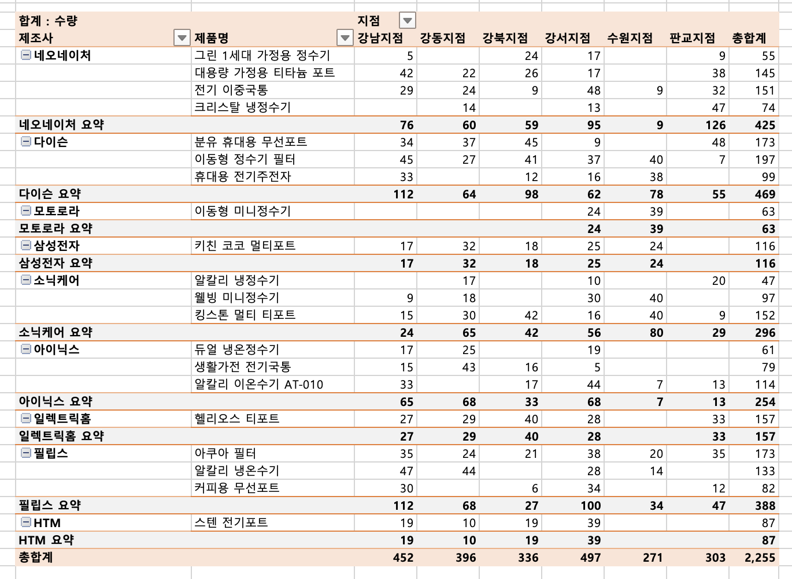
 
 

| 집계 방식 | 의미 |
| --- | --- |
| 합계 | 값의 합을 계산함 |
| 개수 | 데이터 개수를 계산함 |
| 평균 | 값의 평균을 계산함 |
| 최대값 | 가장 큰 값을 표시함 |
| 최소값 | 가장 작은 값을 표시함 |
| 표본 표준편차 | 표본을 기준으로 표준편차를 계산함 |
| 표준편차 | 전체 데이터를 기준으로 표준편차를 계산함 |
| 표본 분산 | 표본을 기준으로 분산을 계산함 |
| 분산 | 전체 데이터를 기준으로 분산을 계산함 |

📌 숫자 데이터는 기본적으로 `합계`, 문자나 빈 값이 포함된 데이터는 `개수`로 집계될 수 있음
 

> **필드 표시 형식 및 집계 방식 변경하여 매출 현황 분석하기(294 ~298p)를 진행 후 인증사진을 첨부해주세요.**
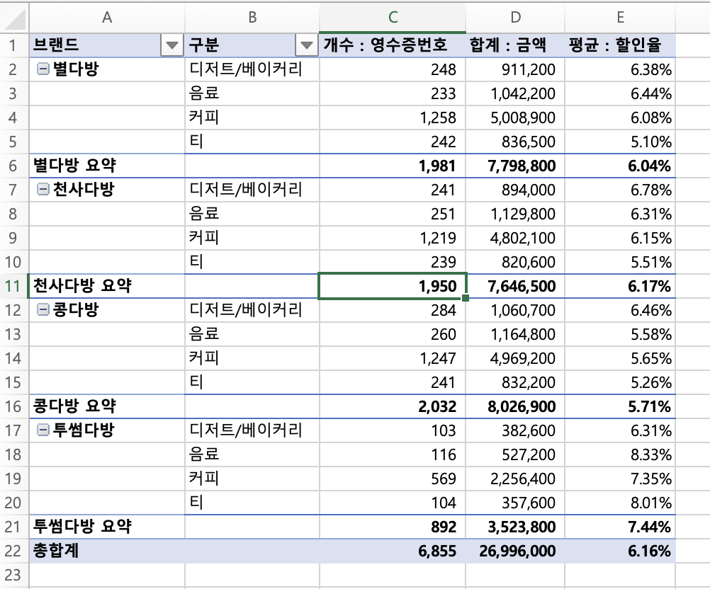
 
 
 

## 06-3. 피벗 테이블의 값 표시 형식 파악하기
### 📌 주요 값 표시 형식

| 값 표시 형식 | 의미 |
| --- | --- |
| 계산 없음 | 집계된 값을 그대로 표시함 |
| 총합계 비율 | 전체 총합계에서 차지하는 비율을 표시함 |
| 행 합계 비율 | 해당 행의 합계에서 차지하는 비율을 표시함 |
| 열 합계 비율 | 해당 열의 합계에서 차지하는 비율을 표시함 |
| 기준값에 대한 비율 | 선택한 기준 항목에 대한 비율을 표시함 |
| 상위 합계 비율 | 상위 항목의 합계에서 차지하는 비율을 표시함 |
| 기준값과의 차이 | 기준 항목과 현재 값의 차이를 표시함 |
| 기준값에 대한 비율의 차이 | 기준 항목과의 차이를 비율로 표시함 |
| 누계 | 기준 필드의 값을 순서대로 누적함 |
| 누계 비율 | 누계 값을 전체 대비 비율로 표시함 |
| 오름차순 순위 지정 | 작은 값부터 순위를 계산함 |
| 내림차순 순위 지정 | 큰 값부터 순위를 계산함 |
| 인덱스 | 행·열 합계를 기준으로 상대적인 중요도를 표시함 |

✅ 값 표시 형식은 원본 데이터를 수정하지 않고 피벗 테이블 안에서 계산 결과를 다른 관점으로 보여주는 기능임
 

### 조건부 서식 적용 시 주의사항

- 피벗 테이블의 값 영역에 조건부 서식을 적용하면 데이터가 갱신되거나 범위가 변해도 적용 범위를 유지할 수 있음
- 조건부 서식의 적용 범위를 `선택한 셀`, `같은 값을 표시하는 모든 셀`, `특정 행·열 필드의 모든 셀` 중에서 지정할 수 있음
 

> **조건부 서식과 값 표시 형식으로 입고 내역 분석하기(300 ~304p)를 진행 후 인증사진을 첨부해주세요.**
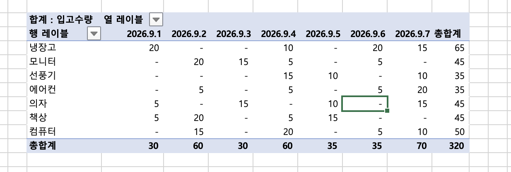
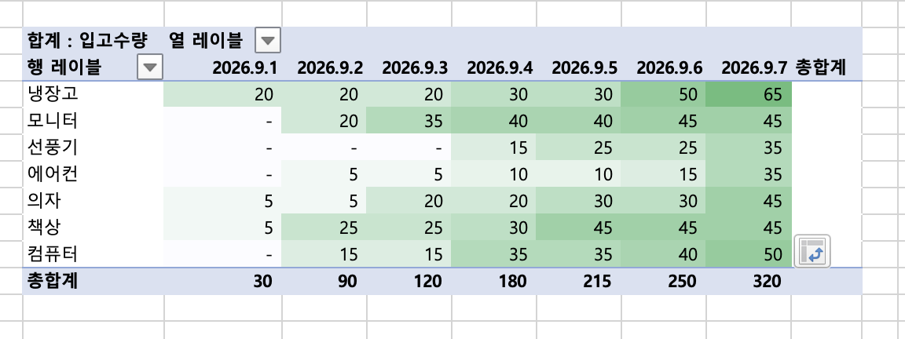
 
 

### 합계와 비율 함께 표시하기

- 같은 값 필드를 `값` 영역에 두 번 배치하면 하나는 합계, 다른 하나는 비율로 동시에 표시할 수 있음
- 값 표시 형식을 `총합계 비율`로 지정하면 전체에서 각 항목이 차지하는 비중을 확인할 수 있음
- 피벗 테이블의 필드 이름은 사용자가 원하는 이름으로 변경 가능함
 

> **값 표시 형식으로 입고 수량의 합계와 비율 표시하기(305 ~306p)를 진행 후 인증사진을 첨부해주세요.**
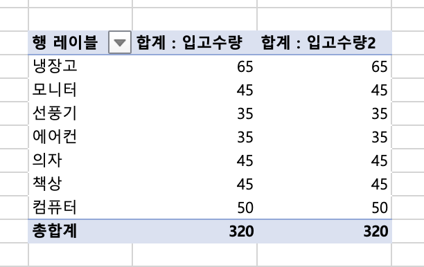
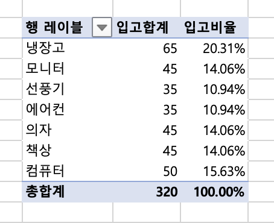
 
 
 

## 06-4. 데이터를 빠르게 집계하는 그룹 및 정렬 기능

### 📌 숫자 데이터 그룹화

숫자 데이터를 일정한 간격으로 묶어 구간별로 분석하는 기능임

| 설정 항목 | 의미 |
| --- | --- |
| 시작값 | 그룹의 시작 값 |
| 끝값 | 그룹의 마지막 값 |
| 단위 | 각 그룹의 간격 |

- 숫자 범위를 직접 여러 개 만들지 않아도 피벗 테이블에서 일정 단위로 자동 그룹화할 수 있음
- 그룹을 해제하면 원래 개별 값으로 다시 표시됨
 

> **그룹 기능으로 구간별 데이터 분석하기(307 ~309p)를 진행 후 인증사진을 첨부해주세요.**
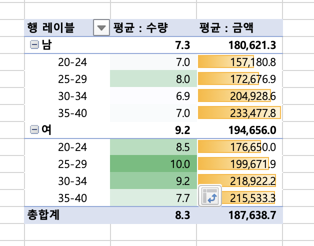

 
 

### 날짜 데이터 그룹화

| 그룹 단위 | 활용 |
| --- | --- |
| 초 / 분 / 시간 | 시간대별 데이터 분석 |
| 일 | 일 단위 또는 일정 일수 단위 분석 |
| 월 | 월별 분석 |
| 분기 | 분기별 분석 |
| 연도 | 연도별 분석 |

- 날짜 필드는 여러 단위를 동시에 선택해 계층 구조로 그룹화할 수 있음
- `일`을 선택하고 일 수를 지정하면 7일 단위 등 원하는 기간으로 묶을 수 있음
- 주 단위 항목은 별도로 제공되지 않으므로 `일` 단위를 7일로 설정해 구현함
 

> **날짜 데이터 그룹화 및 일주일 단위로 구분하기(310 ~312p)를 진행 후 인증사진을 첨부해주세요.**
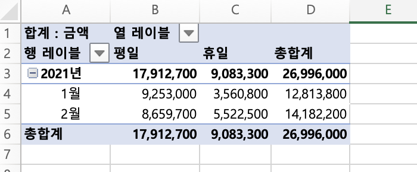
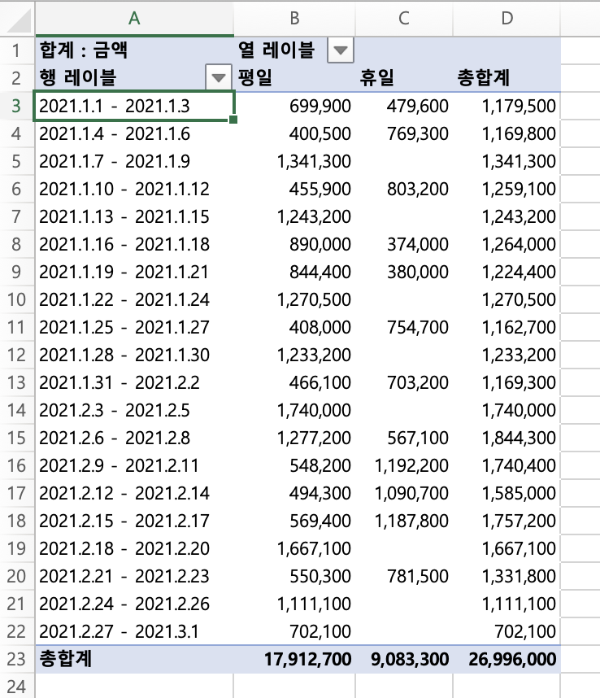
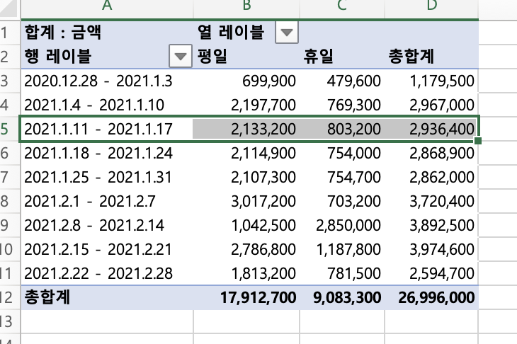
 
 

### 피벗 테이블의 필터 종류

| 필터 종류 | 대상 | 특징 |
| --- | --- | --- |
| 보고서 필터 | 필터 영역에 배치한 필드 | 보고서 전체를 특정 항목 기준으로 필터링함 |
| 레이블 필터 | 행·열 영역의 필드 | 텍스트 조건을 기준으로 필터링함 |
| 값 필터 | 값 영역의 집계 결과 | 합계·평균 등 집계 결과를 기준으로 필터링함 |

- `상위 10` 값 필터를 이용하면 매출액이나 평균 금액이 높은 항목을 빠르게 추출할 수 있음
 

> **필터 및 정렬 기능으로 우수 고객 빠르게 파악하기(313 ~316p)를 진행 후 인증사진을 첨부해주세요.**
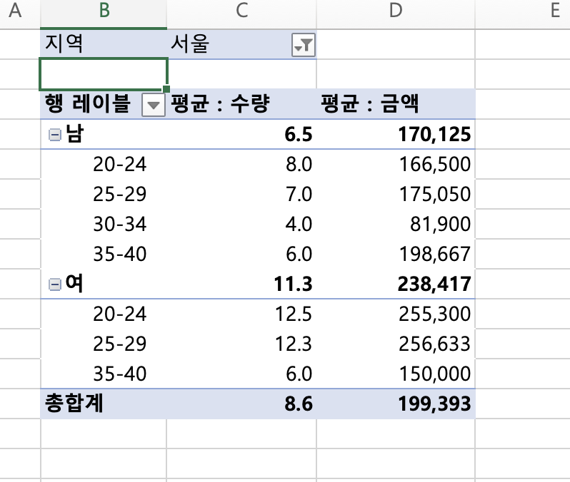
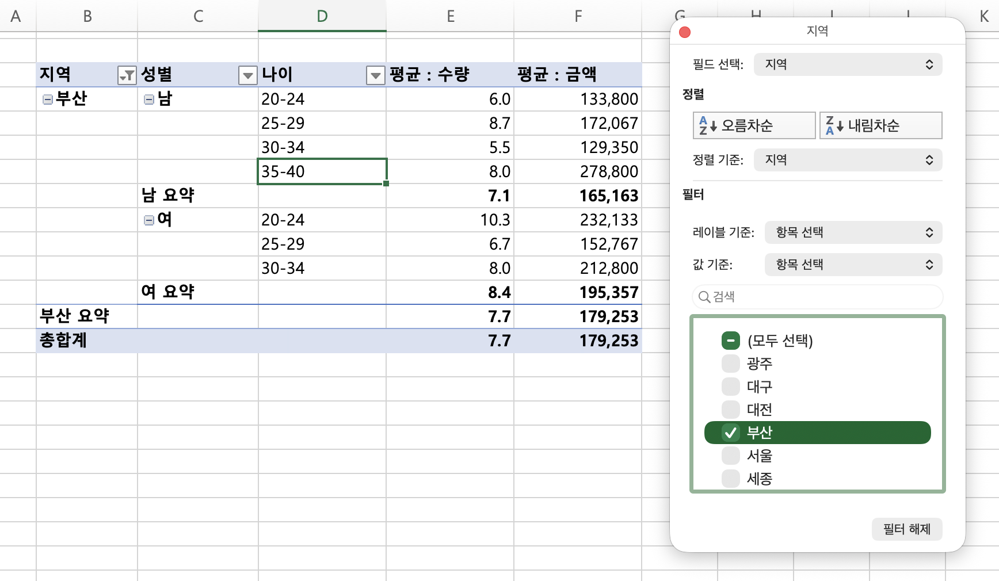
 
 
 

## 06-5. 피벗 테이블의 활용도를 높여 줄 유용한 기능

### 📌 계산 필드와 계산 항목

| 구분 | 계산 필드 | 계산 항목 |
| --- | --- | --- |
| 기준 | 기존 필드를 이용해 새로운 필드를 계산함 | 특정 필드 안의 항목을 이용해 새로운 항목을 계산함 |
| 예시 | `매출이익 / 매출` | `2021년 - 2020년` |
| 결과 | 값 영역에 새로운 필드가 추가됨 | 기존 행·열 필드에 새로운 항목이 추가됨 |
| 주의사항 | 일반적인 셀 참조 방식은 사용할 수 없음 | 그룹화된 필드에서는 사용할 수 없음 |

⚠️ 계산 필드에서는 일반 워크시트처럼 셀 주소를 직접 참조하는 방식이 아니라 **피벗 테이블의 필드 이름을 사용**함
 

### 계산 필드의 `#DIV/0!` 오류

- 나누는 값이 `0`인 경우 `#DIV/0!` 오류가 발생할 수 있음
- **[피벗 테이블 옵션] → [레이아웃 및 서식] → [오류 값 표시]**에서 오류 대신 표시할 값을 지정할 수 있음
- 오류 값을 빈칸이나 `0`, `-` 등으로 표시하여 보고서 가독성을 높일 수 있음
 

> **계산 필드로 매출이익률 구하고 #DIV/O! 오류 해결하기(320 ~322p)를 진행 후 인증사진을 첨부해주세요.**
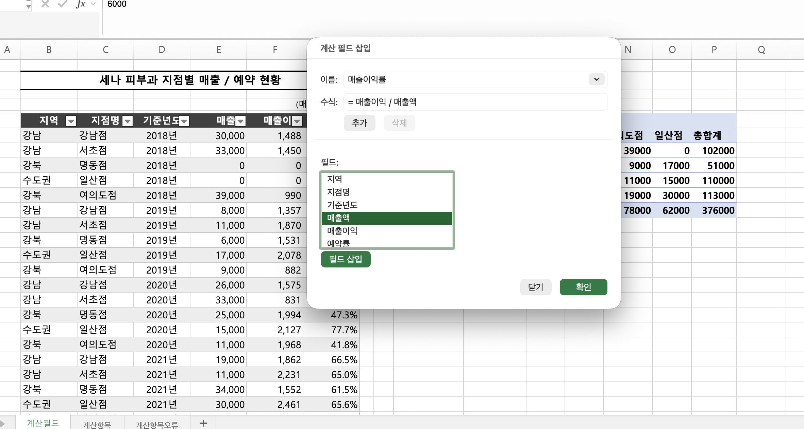
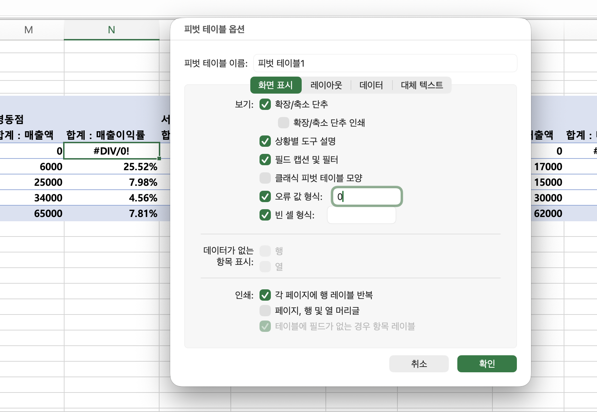
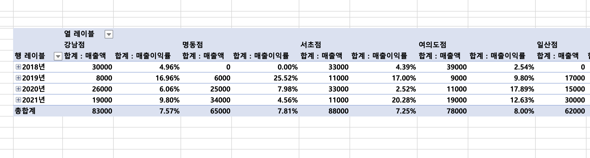
 
 

### 계산 항목 사용 시 주의사항

- 계산 항목은 행 또는 열 영역에 배치된 **필드의 개별 항목끼리 계산**할 때 사용함
- 피벗 테이블에서 그룹화된 필드에는 계산 항목을 사용할 수 없음
- 계산 항목을 사용하려면 먼저 해당 필드의 그룹화를 해제해야 함
- 계산 항목은 원본 데이터에는 추가되지 않고 피벗 테이블 안에서만 계산됨
 

> **계산 항목으로 행과 열의 항목 간 계산된 값 추가하기(322 ~325p)를 진행 후 인증사진을 첨부해주세요.**
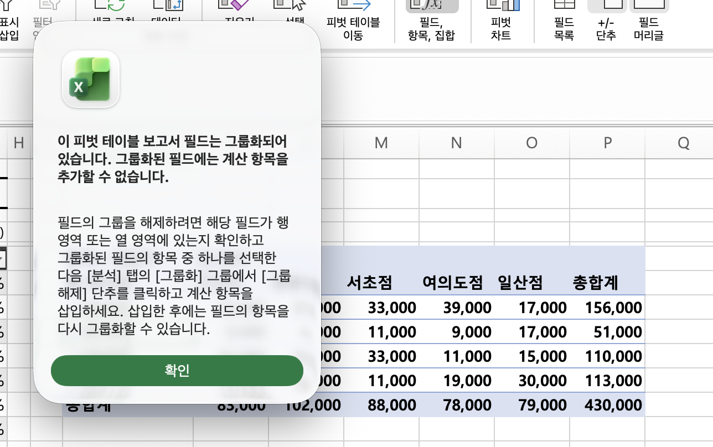
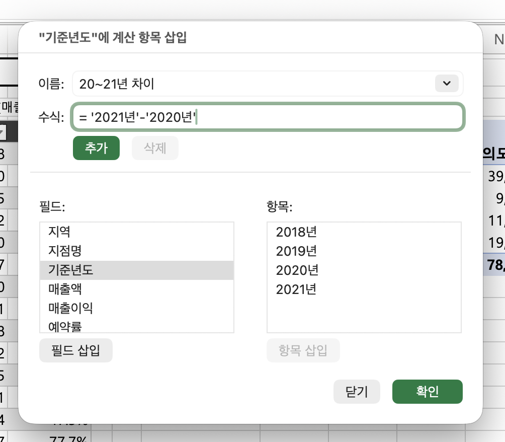
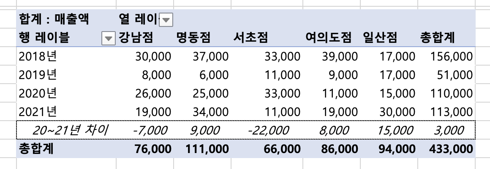
 
 

## 06-6. 실시간 데이터 분석을 위한 슬라이서, 시간 표시 막대

### 📌 슬라이서

피벗 테이블의 필터 항목을 버튼 형태로 표시하여 원하는 항목을 빠르게 선택할 수 있는 기능임

| 기능 | 의미 |
| --- | --- |
| 단일 선택 | 하나의 항목만 선택하여 필터링함 |
| 다중 선택 | 여러 항목을 동시에 선택함 |
| 필터 지우기 | 적용된 슬라이서 필터를 초기화함 |
| 열 설정 | 슬라이서 버튼을 여러 열로 배치함 |
| 스타일 | 슬라이서의 색상과 디자인을 변경함 |

✅ 슬라이서의 버튼을 클릭하면 연결된 피벗 테이블이 즉시 필터링됨
 

> **피벗 레이블의 최강 콤비, 슬라이서 추가하기(326 ~329p)를 진행 후 인증사진을 첨부해주세요.**
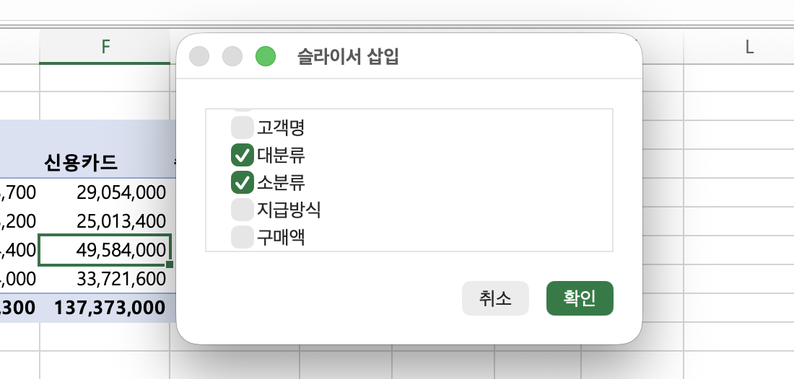
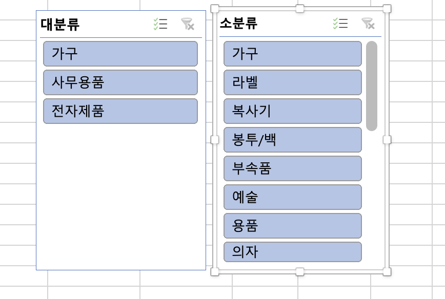
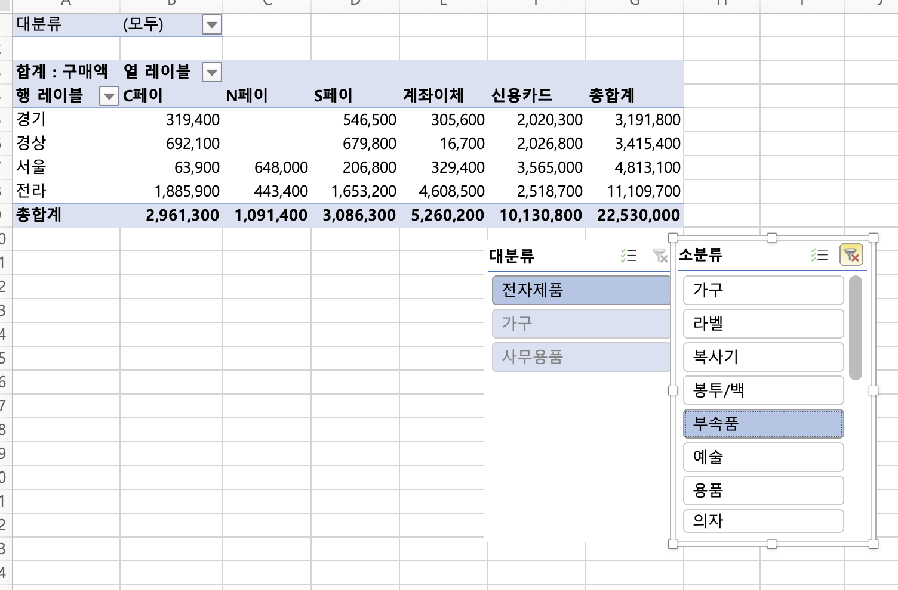
 
 

### 시간 표시 막대

날짜 필드를 연도·분기·월·일 단위로 빠르게 필터링할 수 있는 기능임

| 특징 | 내용 |
| --- | --- |
| 사용 조건 | 원본 데이터에 날짜 형식의 필드가 있어야 함 |
| 선택 단위 | 연도, 분기, 월, 일 |
| 기간 선택 | 막대를 드래그하여 연속된 기간을 선택함 |
| 활용 | 월별·분기별·연도별 보고서 필터링에 적합함 |

⚠️ 날짜로 보이는 텍스트가 아니라 엑셀이 실제 날짜 데이터로 인식하는 값이어야 함
 

> **시간 표시 막대와 슬라이서로 날짜 필터링하기(329 ~332p)를 진행 후 인증사진을 첨부해주세요.**
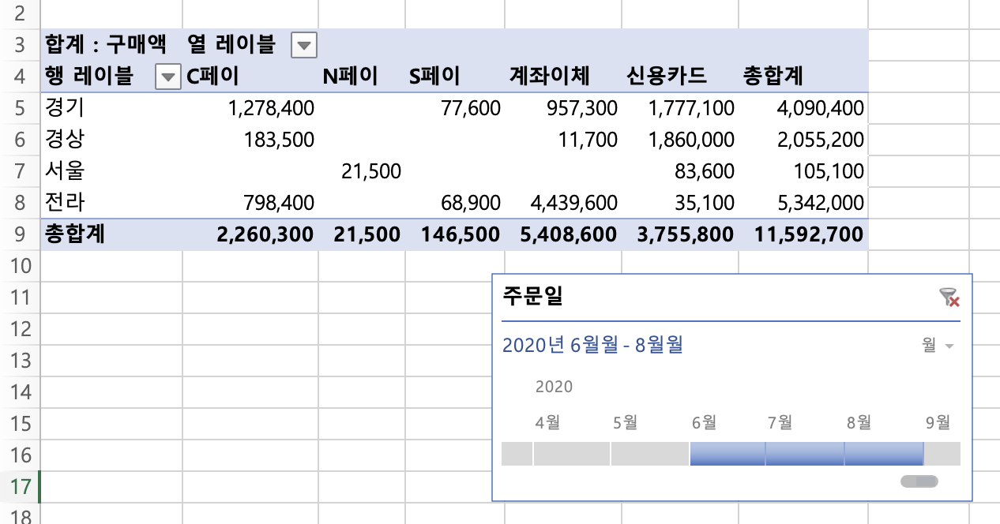
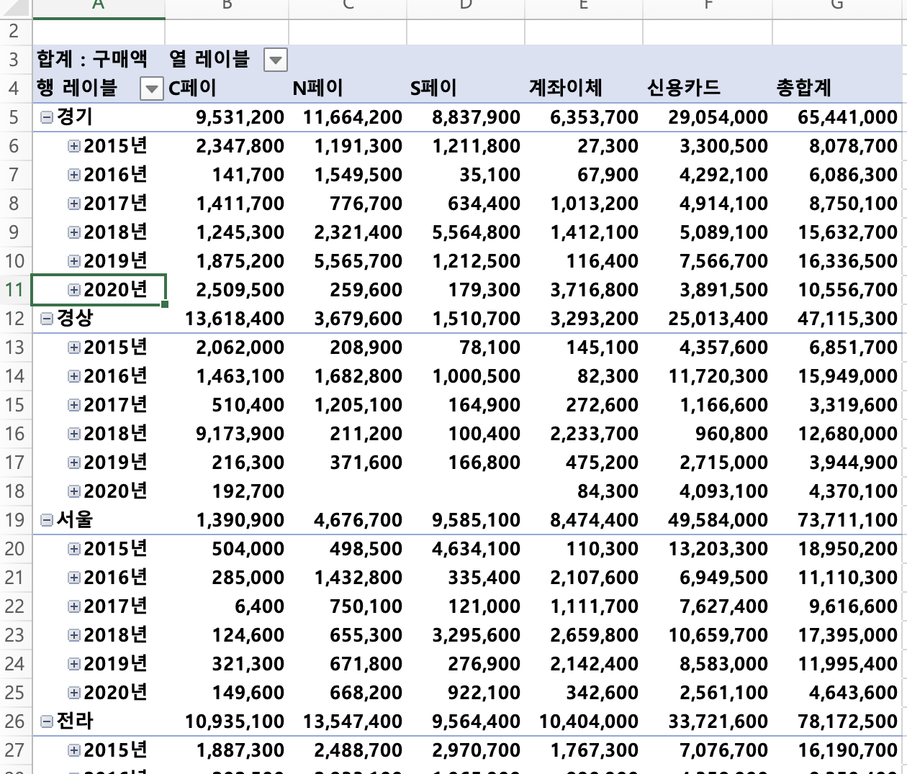
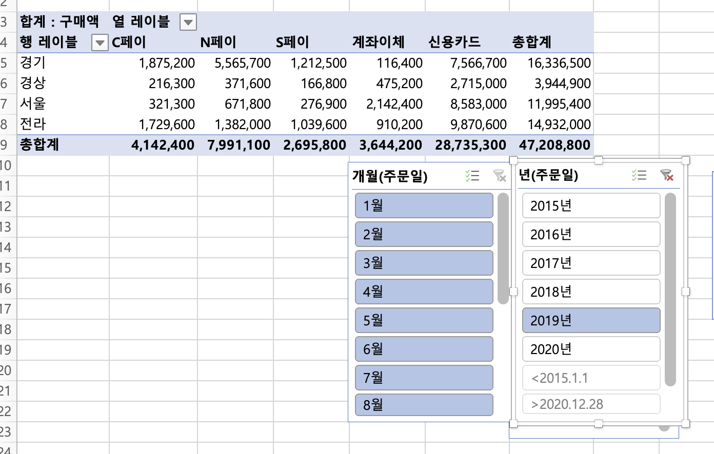
 
 

### 대시보드용 슬라이서 설정

- 슬라이서 스타일을 변경하여 보고서 디자인과 통일할 수 있음
- 기존 스타일을 복제하여 글꼴·채우기·테두리 등 세부 요소를 수정할 수 있음
- `데이터가 없는 항목 숨기기`를 설정하면 현재 조건에서 값이 없는 버튼을 숨길 수 있음
- 슬라이서의 높이·너비·열 수를 조정하여 대시보드 공간에 맞게 배치함
 

> **대시보드 제작을 위한 슬라이서 꾸미기(333 ~335p)를 진행 후 인증사진을 첨부해주세요.**
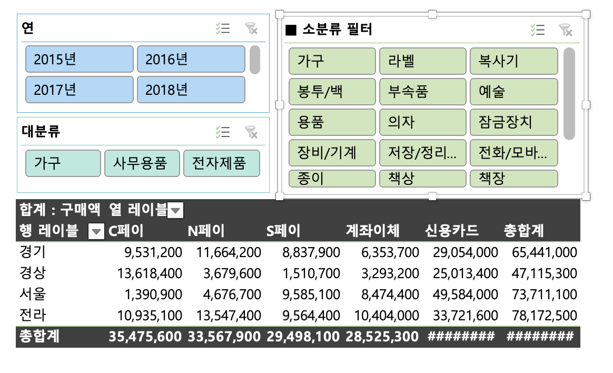
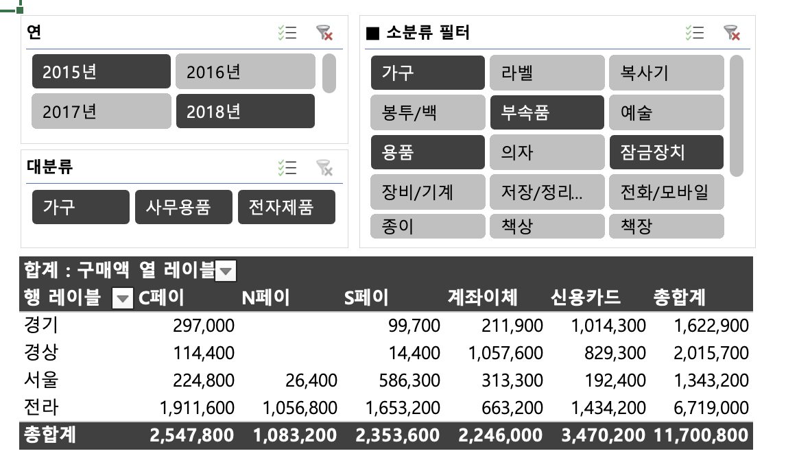
 
 

### ✅ 여러 피벗 테이블 동시 필터링

- 하나의 슬라이서를 여러 피벗 테이블에 연결할 수 있음
- **[보고서 연결]**에서 같은 슬라이서로 제어할 피벗 테이블을 선택함
- 연결된 피벗 테이블은 슬라이서 선택에 따라 동시에 필터링됨
- 동일한 원본 데이터를 사용하는 피벗 테이블끼리 연결할 때 활용하기 좋음

⚠️ 피벗 테이블의 원본 범위나 피벗 캐시가 서로 다르면 보고서 연결이 제한될 수 있음
 

> **여러 피벗 테이블을 동시에 필터링하기(336 ~338p)를 진행 후 인증사진을 첨부해주세요.**
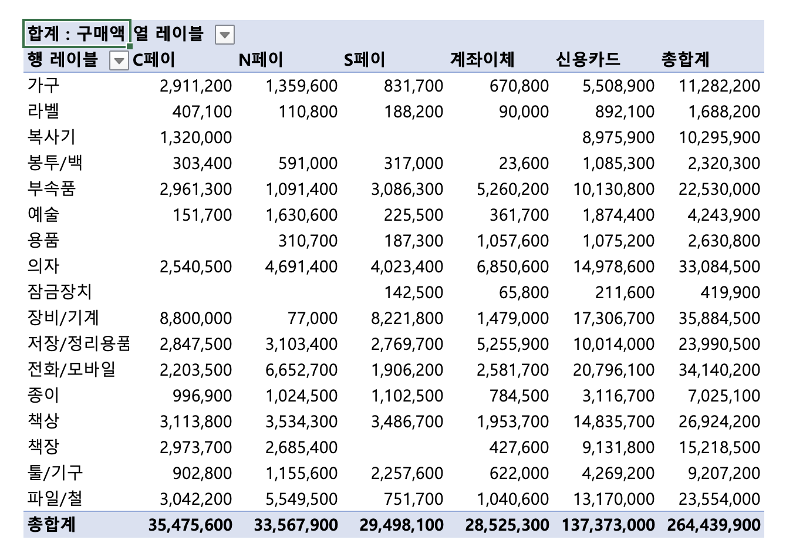
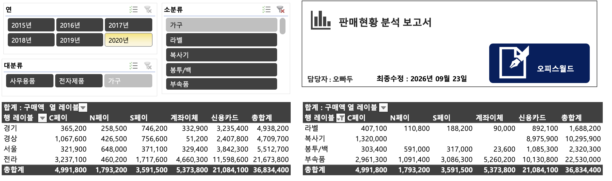

---

### 🎉 수고하셨습니다.

