# Excel 6주차 정규 과제 

📌Excel 정규과제는 매주 정해진 분량의 『*진짜 쓰는 실무 엑셀*』 을 읽고 학습하는 것입니다. 이번주는 아래의 **EXCEL_6th_TIL**에 나열된 분량을 읽고 공부하시면 됩니다.

아래의 문제를 풀어보며 학습 내용을 점검하세요. 문제를 해결하는 과정에서 개념을 스스로 정리하고, 필요한 경우 제시된 강의를 참고하여 보완하는 것이 좋습니다.

**교재 실습 예제 파일은 1주차 과제 설명 노션에 있습니다. 해당 파일을 다운 후 실습 진행해주시면 됩니다.**

**👀(수행 인증샷은 필수입니다.)** 

## EXCEL_6th_TIL

### 7장 엑셀 활용의 10%를 채워 줄 기본 & 필수 함수 익히기
#### 01. 엑셀 기초 계산 함수와 통계 함수 사용하기
#### 02. 논리 함수, 참조 함수, 집계 함수
#### 03. 엑셀의 활용도를 올려 줄 실무 보조 함수
#### 04. 더 강력해진 기능의 엑셀 2021 이후 버전, M365 신규 함수
#### 05. 실무에서 발생하는 어려움을 해결하는 필수 함수 공식

## Study Schedule

| 주차  | 공부 범위     | 완료 여부 |
| ----- | ------------- | --------- |
| 1주차 | p.22~111    | ✅         |
| 2주차 | p.112~157   | ✅         |
| 3주차 | p.158~213  | ✅         |
| 4주차 | p.214~273 | ✅         |
| 5주차 | p.274~339 | ✅         |
| 6주차 | p.340~425 | ✅         |
| 7주차 | p.426~472 | 🍽️         |


<br>

<!-- 여기까진 그대로 둬 주세요-->

---

# 1️⃣ 학습 내용 정리

## 07-1. 엑셀 기초 계산 함수와 통계 함수 사용하기

### 📌 기본 계산 함수

| 함수 | 기본 구조 | 기능 |
| --- | --- | --- |
| `SUM` | `=SUM(범위)` | 범위의 합계를 계산함 |
| `AVERAGE` | `=AVERAGE(범위)` | 범위의 평균을 계산함 |
| `COUNTA` | `=COUNTA(범위)` | 비어 있지 않은 셀의 개수를 계산함 |

- `SUM`, `AVERAGE`, `COUNTA`는 연속된 범위를 지정해 기본적인 데이터 현황을 빠르게 집계할 때 사용함
- `COUNTA`는 숫자뿐만 아니라 문자 등 값이 입력된 셀도 개수에 포함함
- 수식 입력 후 채우기 핸들을 사용하면 동일한 계산을 다른 행이나 열에 빠르게 적용 가능함

> **SUM, AVERAGE, COUNTA 함수로 재고 현황 파악하기(342 ~ 344p)를 진행 후 인증사진을 첨부해주세요.**
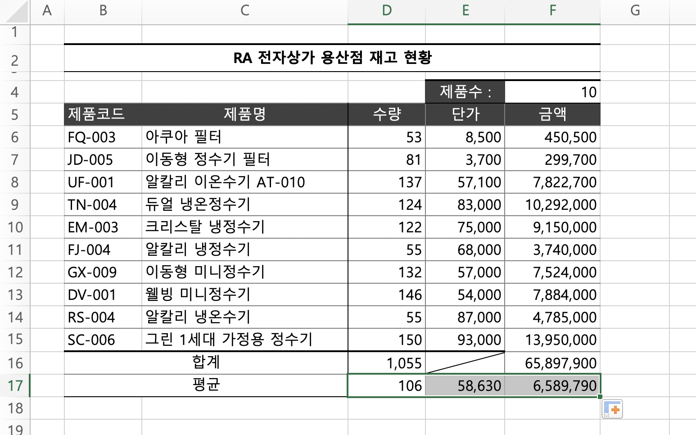


### ✅ 최대·최소값과 순위값 함수

| 함수 | 기본 구조 | 기능 |
| --- | --- | --- |
| `MAX` | `=MAX(범위)` | 범위에서 가장 큰 값을 반환함 |
| `MIN` | `=MIN(범위)` | 범위에서 가장 작은 값을 반환함 |
| `LARGE` | `=LARGE(범위, k)` | 범위에서 k번째로 큰 값을 반환함 |
| `SMALL` | `=SMALL(범위, k)` | 범위에서 k번째로 작은 값을 반환함 |

📌 `MAX`, `MIN`은 최댓값·최솟값 한 개를 찾을 때 사용하며 `LARGE`, `SMALL`은 원하는 순위의 값을 찾을 때 사용함

> **MAX, MIN, LARGE, SMALL 함수로 만족도 통계 구하기(345 ~ 347p)를 진행 후 인증사진을 첨부해주세요.**
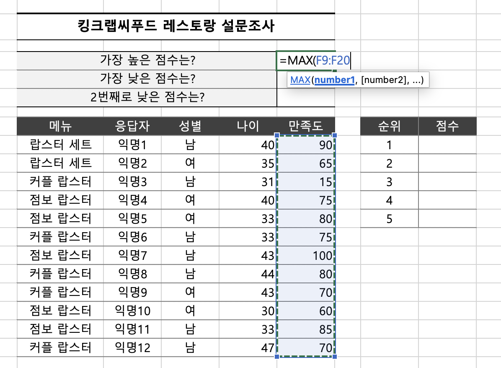
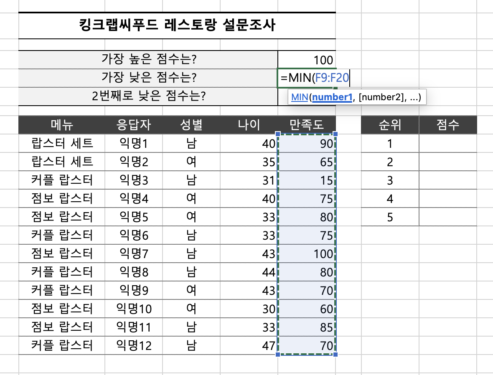
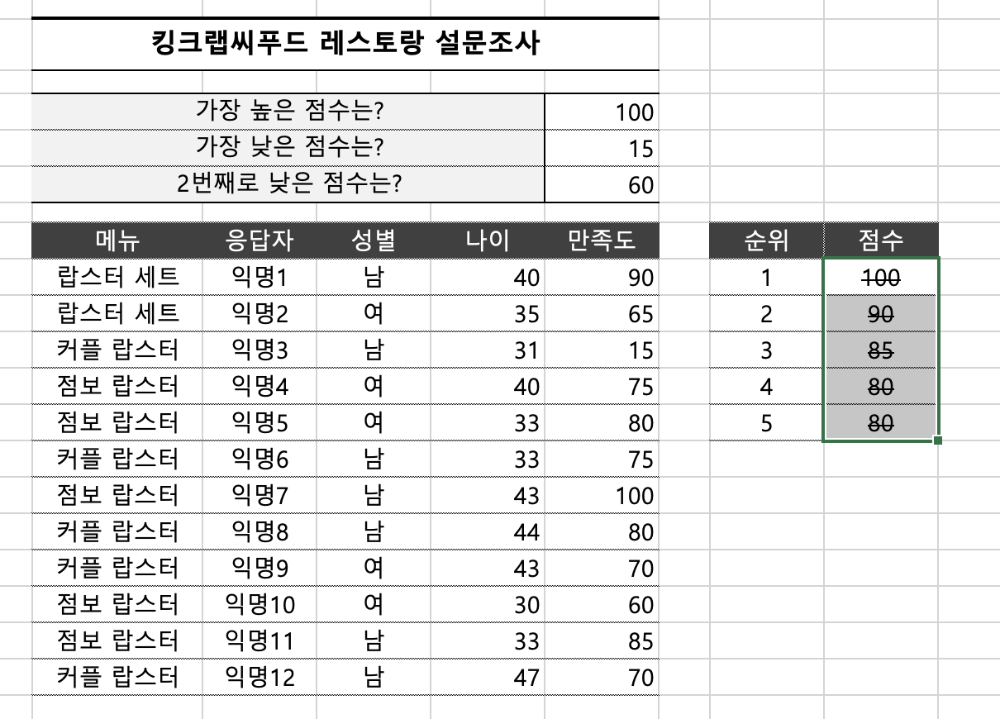


## 07-2. 논리 함수, 참조 함수, 집계 함수

### 📌 IF 함수

조건의 결과가 `TRUE`인지 `FALSE`인지에 따라 서로 다른 결과를 반환하는 함수임

```text
=IF(조건, 참일 때 결과, 거짓일 때 결과)
```

| 비교 연산자 | 의미 |
| --- | --- |
| `=` | 같음 |
| `>` | 큼 |
| `<` | 작음 |
| `>=` | 크거나 같음 |
| `<=` | 작거나 같음 |
| `<>` | 같지 않음 |

⚠️ 문자 결과를 수식 안에 직접 입력할 경우 큰따옴표 `" "`로 감싸야 함

> **IF 함수로 성적 관리하기(348 ~ 350p)를 진행 후 인증사진을 첨부해주세요.**
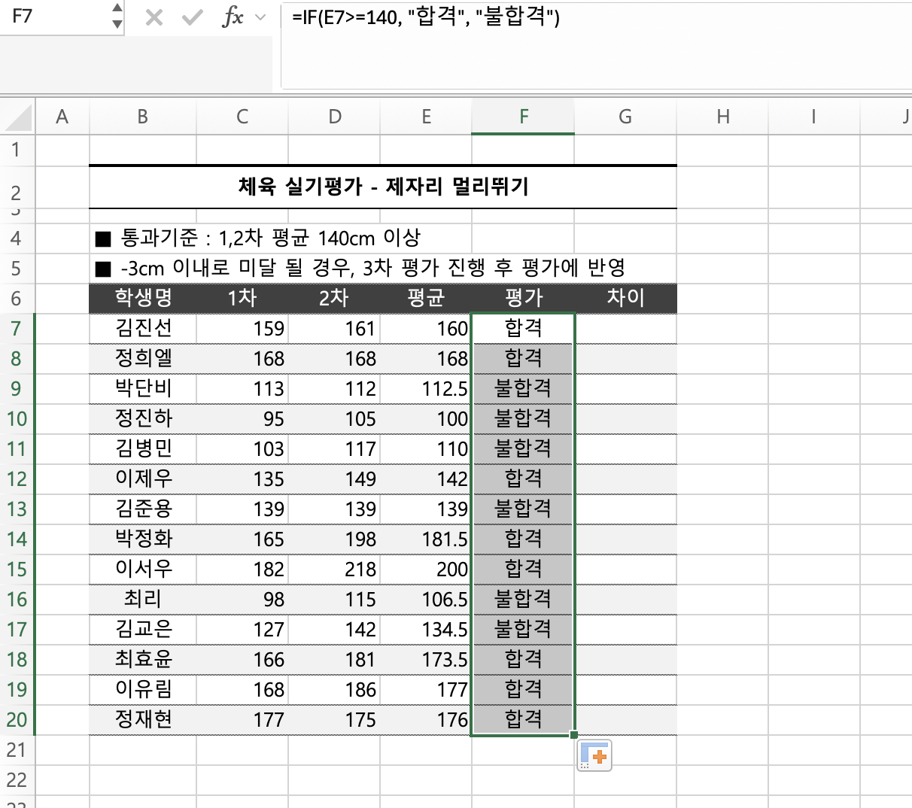
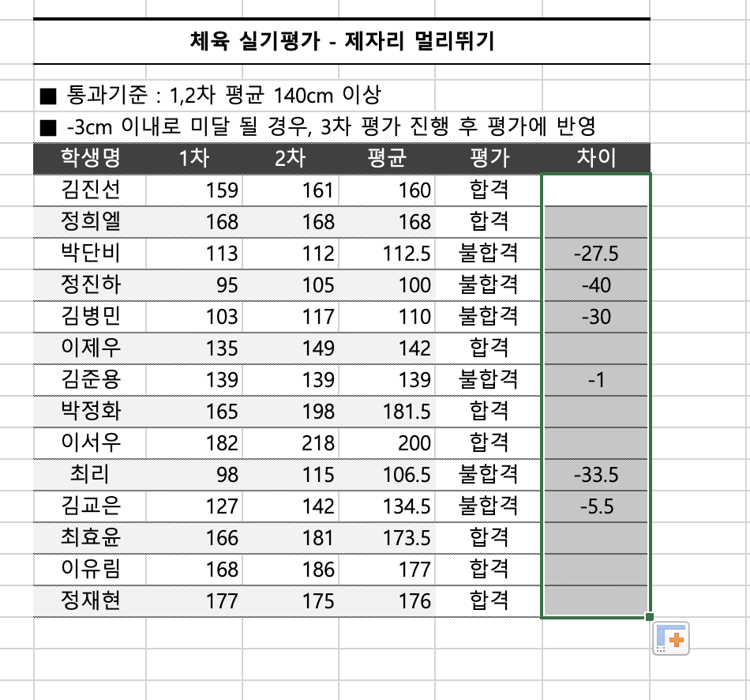


### ✅ VLOOKUP과 IFERROR

| 함수 | 기본 구조 | 기능 |
| --- | --- | --- |
| `VLOOKUP` | `=VLOOKUP(찾을값, 참조범위, 열번호, 일치방식)` | 기준값을 범위의 첫 번째 열에서 찾은 뒤 지정한 열의 값을 반환함 |
| `IFERROR` | `=IFERROR(수식, 오류일 때 값)` | 수식의 결과가 오류일 경우 지정한 값으로 변경함 |

#### VLOOKUP 일치 방식

| 값 | 의미 |
| --- | --- |
| `FALSE` 또는 `0` | 정확히 일치하는 값을 검색함 |
| `TRUE` 또는 `1` | 근삿값을 검색함 |

- VLOOKUP의 기준값은 **참조 범위의 첫 번째 열**에 있어야 함
- 정확한 코드·상품명 등을 찾는 경우 네 번째 인수에 `FALSE` 또는 `0`을 사용하는 것이 기본임
- `IFERROR`를 함께 사용하면 `#N/A`와 같은 오류를 원하는 문자나 빈칸으로 처리 가능함

> **VLOOKUP, IFERROR 함수로 재고 현황 관리하기(351 ~ 355p)를 진행 후 인증사진을 첨부해주세요.**
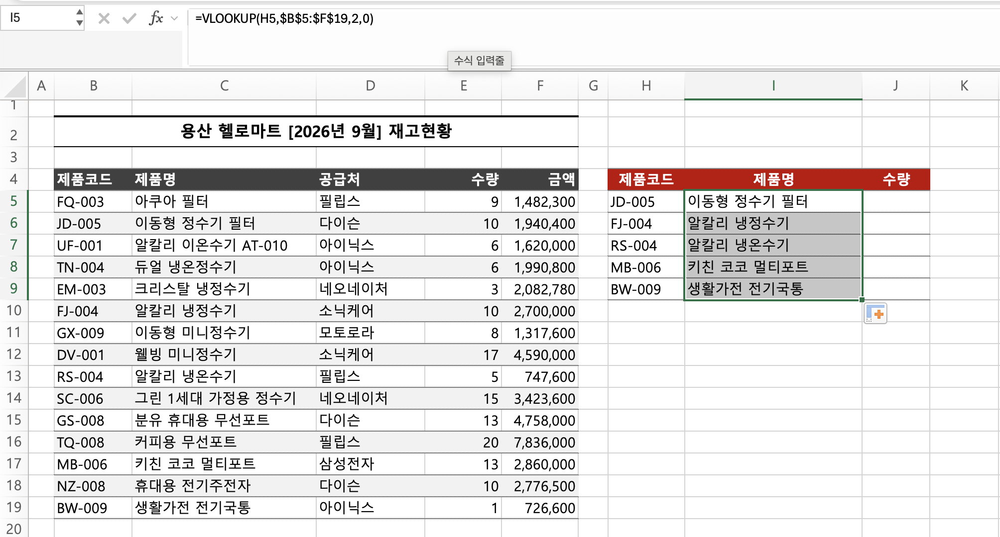
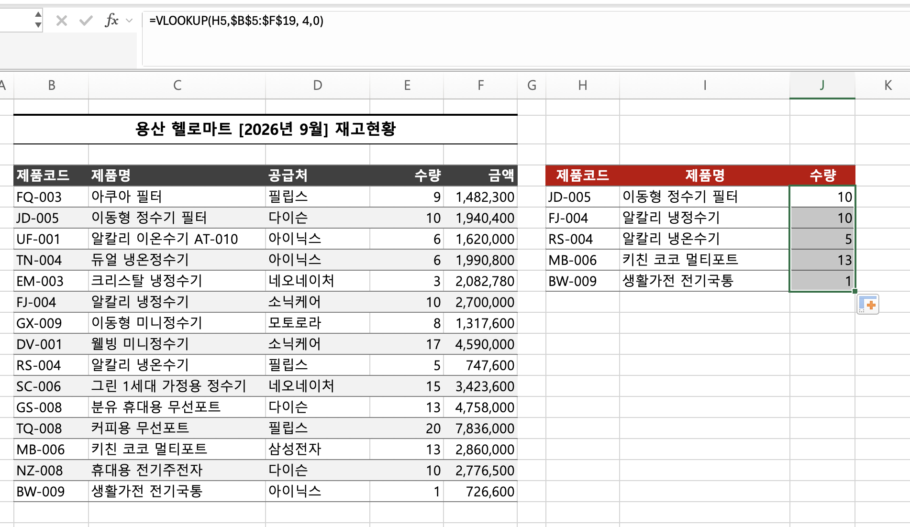
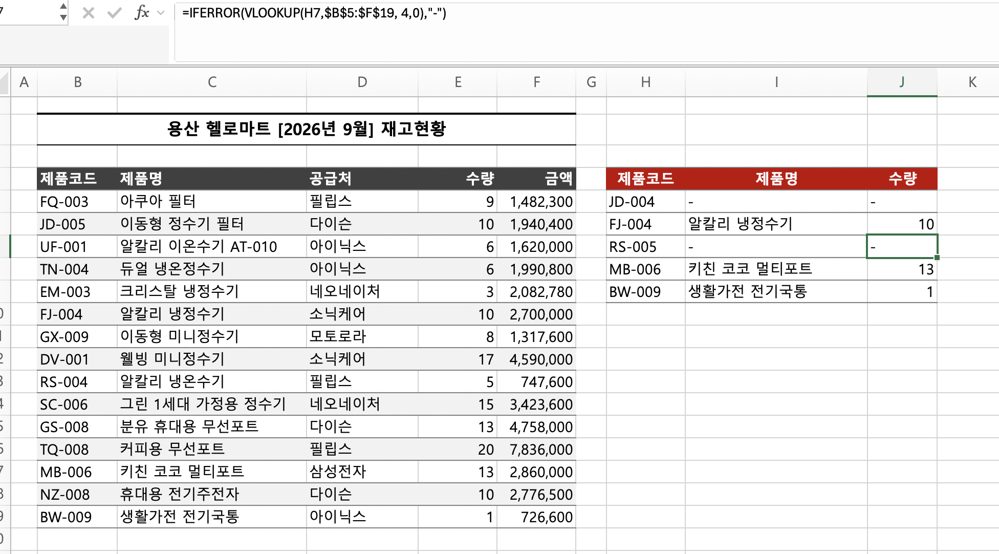


### 📌 조건에 따라 집계하는 함수

| 함수 | 기본 구조 | 기능 |
| --- | --- | --- |
| `SUMIF` | `=SUMIF(조건범위, 조건, 합계범위)` | 하나의 조건을 만족하는 값의 합계를 계산함 |
| `SUMIFS` | `=SUMIFS(합계범위, 조건범위1, 조건1, ...)` | 여러 조건을 모두 만족하는 값의 합계를 계산함 |
| `COUNTIF` | `=COUNTIF(조건범위, 조건)` | 하나의 조건을 만족하는 셀의 개수를 계산함 |
| `COUNTIFS` | `=COUNTIFS(조건범위1, 조건1, ...)` | 여러 조건을 모두 만족하는 셀의 개수를 계산함 |
| `AVERAGEIF` | `=AVERAGEIF(조건범위, 조건, 평균범위)` | 하나의 조건을 만족하는 값의 평균을 계산함 |
| `AVERAGEIFS` | `=AVERAGEIFS(평균범위, 조건범위1, 조건1, ...)` | 여러 조건을 모두 만족하는 값의 평균을 계산함 |

📌 `SUMIFS`처럼 함수 이름 뒤에 `S`가 붙은 함수는 여러 개의 조건을 지정할 때 사용함

⚠️ 여러 조건 범위를 지정할 경우 각 범위의 행·열 크기를 동일하게 맞춰야 함

> **SUMIF, COUNTIF, AVERAGEIF 함수로 매출, 배송 현황 관리(355 ~ 365p)를 진행 후 인증사진을 첨부해주세요.**
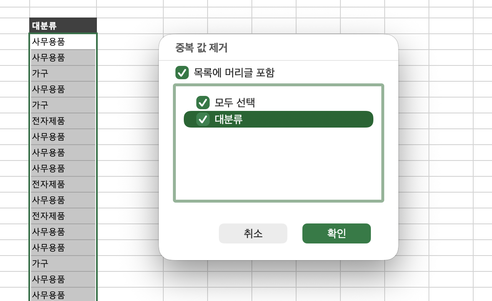
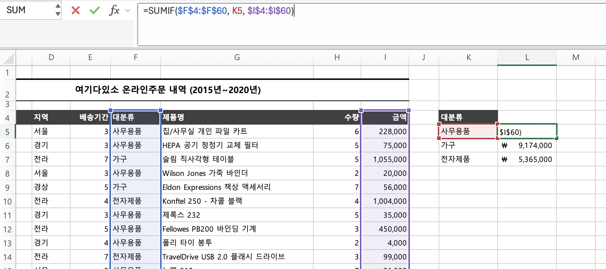

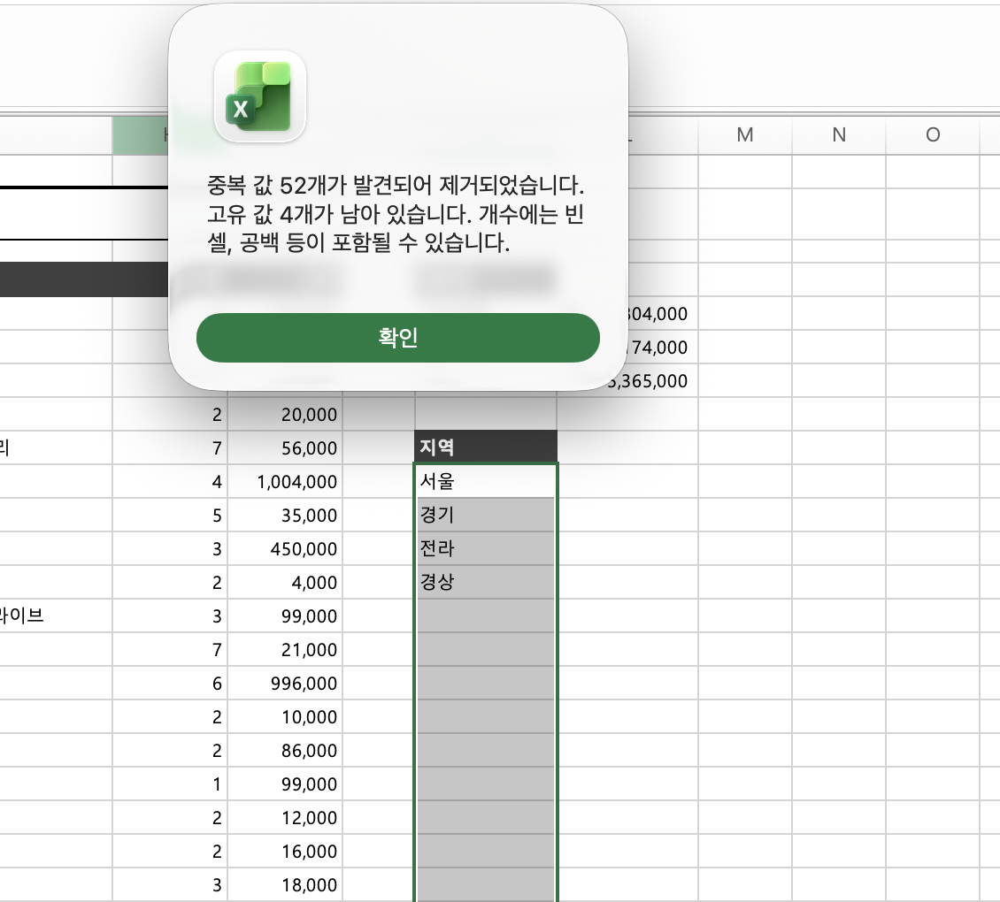
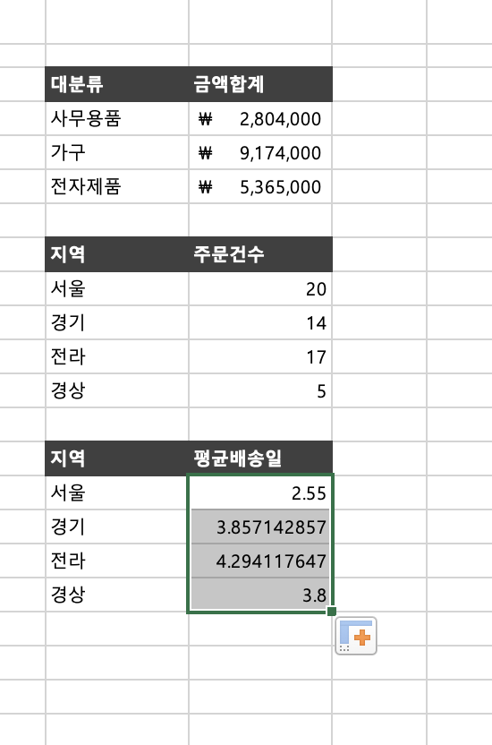
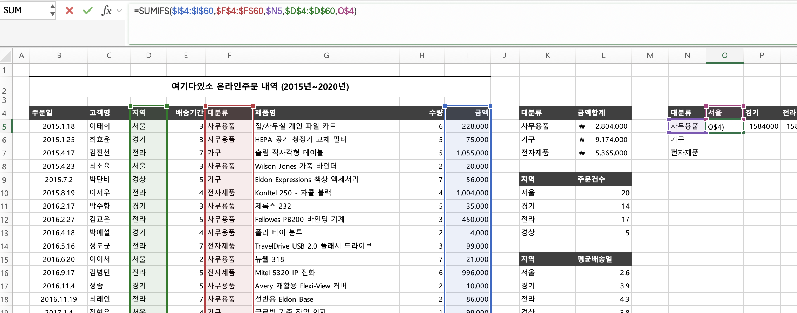
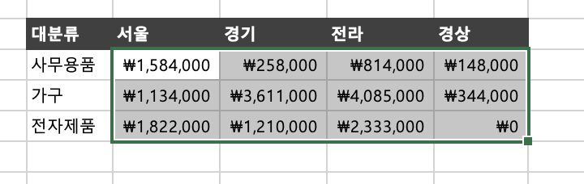


## 07-3. 엑셀의 활용도를 올려 줄 실무 보조 함수

### 📌 텍스트 추출 함수

| 함수 | 기본 구조 | 기능 |
| --- | --- | --- |
| `LEFT` | `=LEFT(문자열, 글자수)` | 문자열의 왼쪽부터 지정한 개수만큼 추출함 |
| `RIGHT` | `=RIGHT(문자열, 글자수)` | 문자열의 오른쪽부터 지정한 개수만큼 추출함 |
| `MID` | `=MID(문자열, 시작위치, 글자수)` | 문자열의 지정한 위치부터 필요한 개수만큼 추출함 |
| `LEN` | `=LEN(문자열)` | 문자열의 전체 글자 수를 계산함 |

- 고정된 규칙으로 작성된 제품 코드·주민등록번호·전화번호 등의 일부 값을 추출할 때 활용 가능함
- `MID`의 시작 위치는 첫 번째 문자를 `1`로 계산함

> **LEFT, RIGHT, MID 함수로 텍스트 가공하기(366 ~ 370p)를 진행 후 인증사진을 첨부해주세요.**
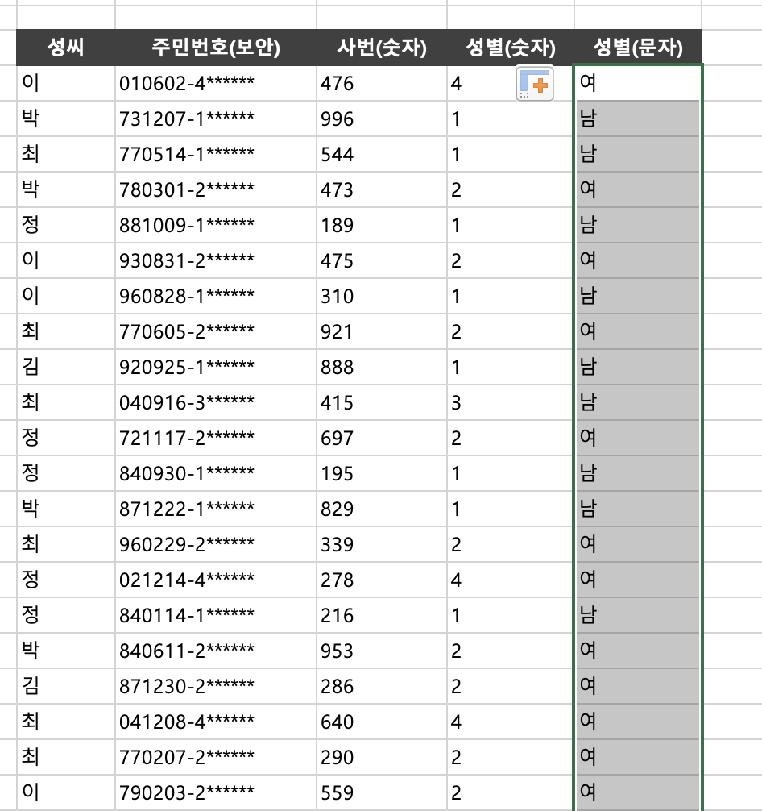


### ✅ TRIM 함수

```text
=TRIM(문자열)
```

- 문자열 앞뒤의 불필요한 공백과 단어 사이에 반복된 공백을 정리하는 함수임
- 육안으로 구분하기 어려운 공백 때문에 `VLOOKUP` 등에서 값이 일치하지 않는 문제를 해결할 때 활용 가능함
- `LEN` 함수로 문자열 길이를 비교하면 숨겨진 공백 여부를 확인하는 데 도움이 됨

> **TRIM 함수 사용으로 보이지 않는 문자로 인한 오류 방지하기(370 ~ 373p)를 진행 후 인증사진을 첨부해주세요.**
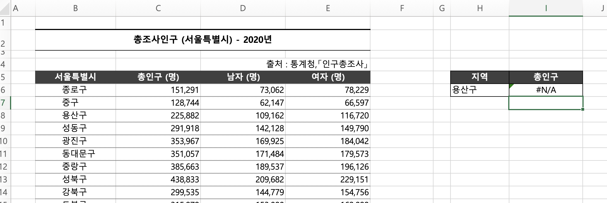
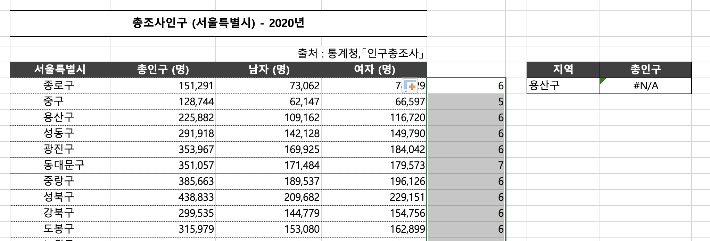

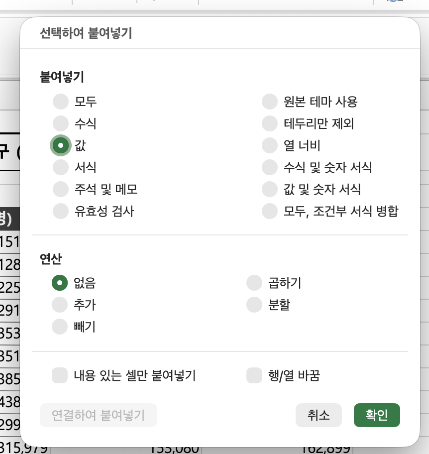
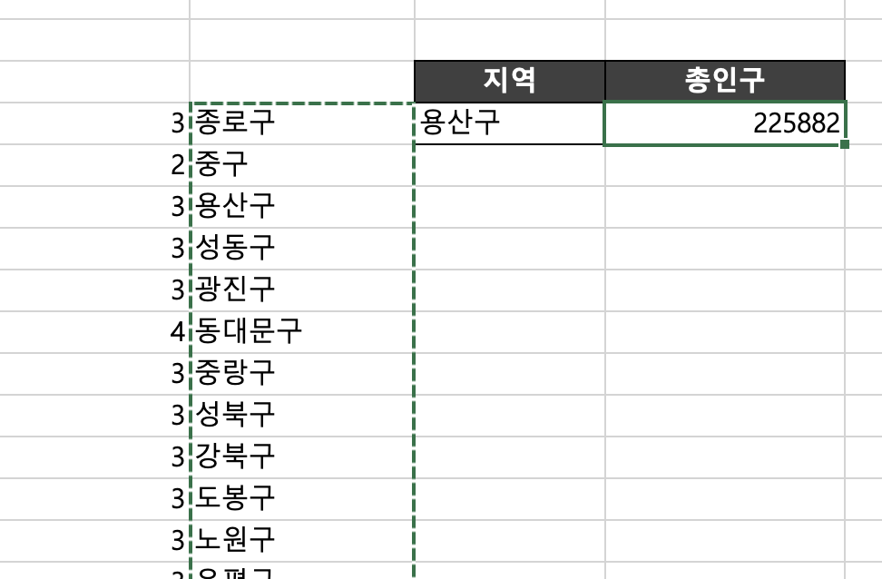


### 📌 날짜 관련 함수

| 함수 | 기본 구조 | 기능 |
| --- | --- | --- |
| `TODAY` | `=TODAY()` | 현재 날짜를 반환함 |
| `DATE` | `=DATE(연도, 월, 일)` | 연·월·일을 이용해 날짜 데이터를 생성함 |
| `YEAR` | `=YEAR(날짜)` | 날짜에서 연도를 추출함 |
| `MONTH` | `=MONTH(날짜)` | 날짜에서 월을 추출함 |
| `DAY` | `=DAY(날짜)` | 날짜에서 일을 추출함 |

- 엑셀의 날짜는 화면에 보이는 형태와 별개로 일련번호 형태의 숫자값으로 저장됨
- `TODAY()`는 파일을 열거나 다시 계산할 때 현재 날짜를 기준으로 자동 갱신됨
- `DATE` 함수는 연·월·일이 각각 다른 셀에 저장된 데이터를 하나의 날짜값으로 만들 때 활용 가능함

> **TODAY, DATE, YEAR/MONTH/DATE 함수로 날짜 구하기(381 ~ 383p)를 진행 후 인증사진을 첨부해주세요.**
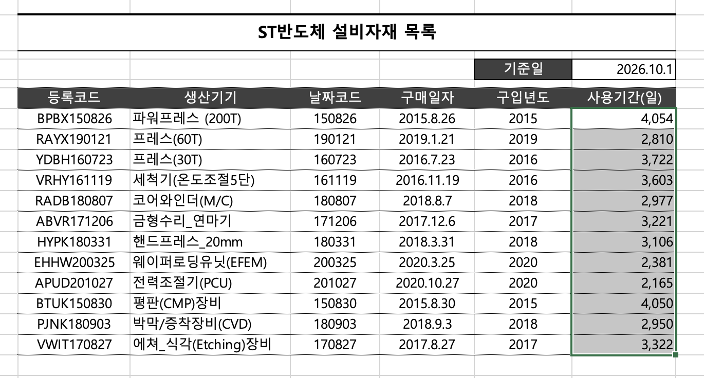


### ✅ INDIRECT 함수

문자열로 입력된 셀 주소를 실제 참조로 변환하는 함수임

```text
=INDIRECT(참조문자열)
```

| 참조 방식 | 특징 |
| --- | --- |
| 일반 셀 참조 | 참조할 시트와 셀 주소를 수식에 직접 입력함 |
| `INDIRECT` | 셀에 입력된 문자나 조합된 문자열을 실제 참조 주소로 사용함 |

- 시트 이름을 셀에 입력해 두고 해당 값을 이용해 여러 시트의 동일한 위치를 동적으로 참조할 수 있음
- 시트명이 변경되는 구조나 월별·지점별 시트를 반복해서 조회할 때 활용 가능함
- 시트 이름에 공백이 포함된 경우 작은따옴표와 `!`를 포함한 형태로 참조 문자열을 구성해야 함

> **INDIRECT 함수로 여러 시트 실시간 참조하기(385 ~ 388p)를 진행 후 인증사진을 첨부해주세요.**
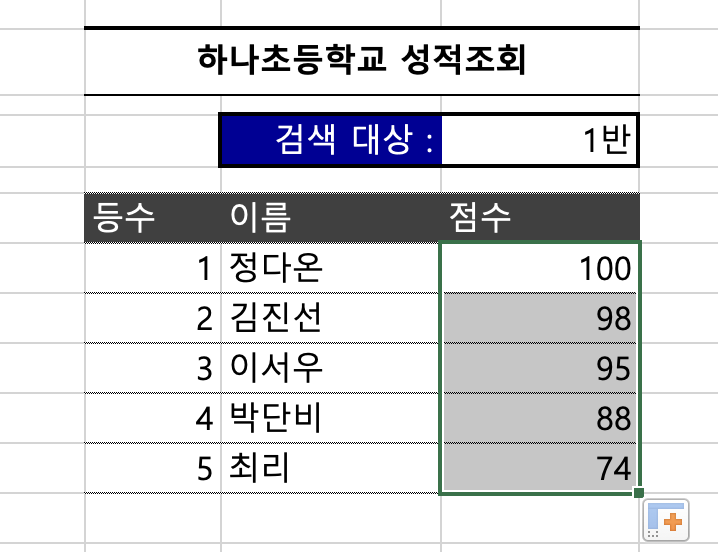
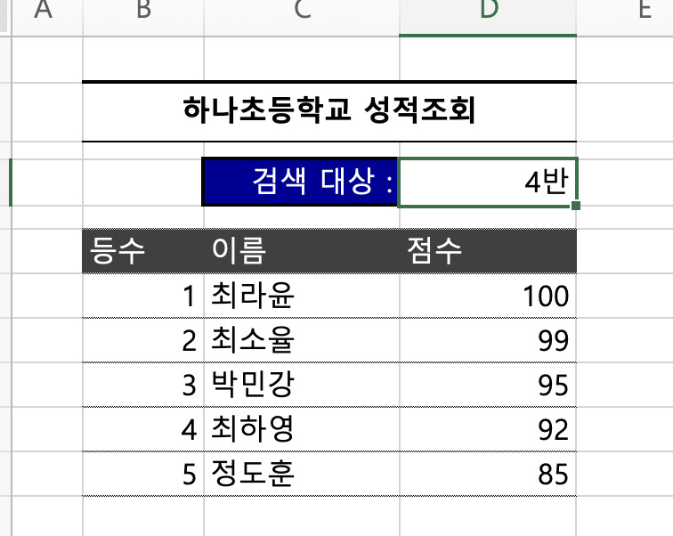


## 07-4. 더 강력해진 기능의 엑셀 2021 이후 버전, M365 신규 함수

### 📌 동적 배열

하나의 수식 결과가 여러 셀에 자동으로 확장되어 표시되는 기능임

- 결과가 표시되는 범위를 **스필(Spill) 범위**라고 함
- 수식을 한 셀에만 입력해도 결과 배열이 주변 셀로 자동 확장됨
- 스필 범위 안에 다른 값이 있으면 `#SPILL!` 오류가 발생할 수 있음
- 최신 버전에서는 배열 수식을 입력할 때 기존 방식의 `Ctrl + Shift + Enter` 사용이 줄어듦

> **최신 버전 엑셀에서 배열 사용하기(391 ~ 392p)를 진행 후 인증사진을 첨부해주세요.**
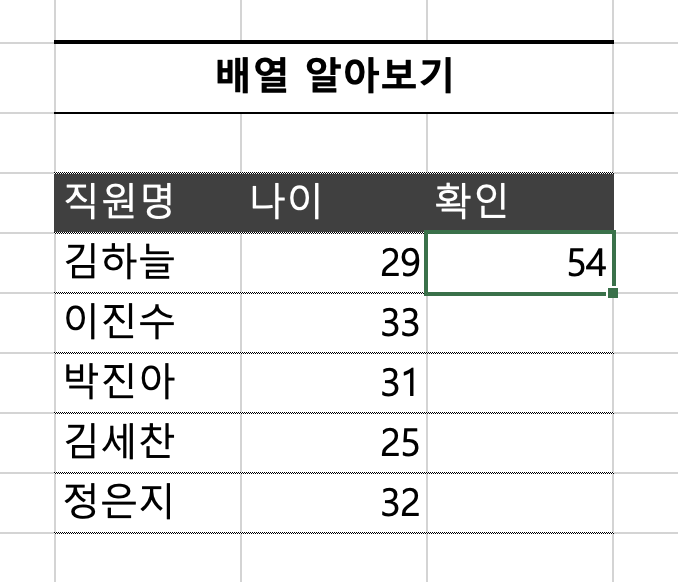

### ✅ FILTER 함수

조건을 만족하는 행 또는 열만 동적으로 추출하는 함수임

```text
=FILTER(배열, 조건, [결과없음])
```

| 인수 | 의미 |
| --- | --- |
| 배열 | 필터링하여 반환할 데이터 범위 |
| 조건 | `TRUE/FALSE`로 판별되는 필터 조건 |
| 결과없음 | 조건을 만족하는 데이터가 없을 때 표시할 값 |

- 원본 데이터를 수정하지 않고 조건에 맞는 결과만 별도 영역에 출력 가능함
- 조건에 사용하는 배열과 원본 배열의 행 또는 열 크기가 서로 맞아야 함
- 조건을 곱셈 `*`으로 연결하면 여러 조건을 동시에 만족하는 형태로 활용 가능함

> **VLOOKUP보다 중요한 필수 신규 함수, FILTER(393 ~ 396p)를 진행 후 인증사진을 첨부해주세요.**
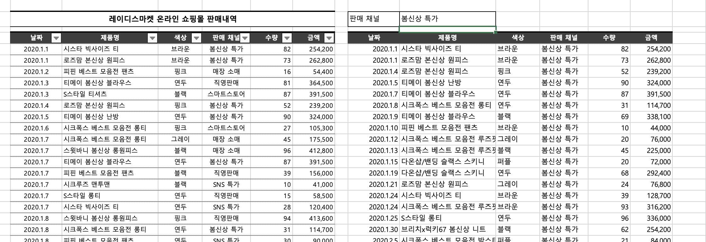
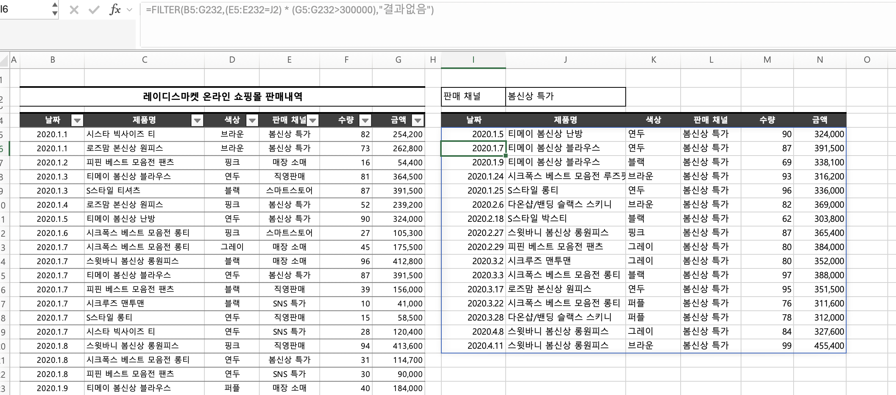
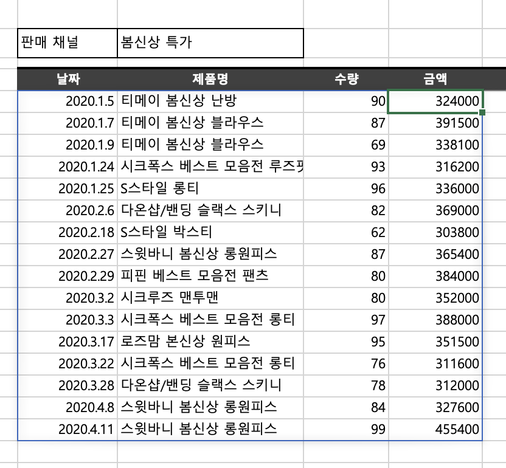


### 📌 XLOOKUP 함수

```text
=XLOOKUP(찾을값, 찾을범위, 반환범위, [찾지못한경우], [일치방식], [검색방식])
```

| 구분 | VLOOKUP | XLOOKUP |
| --- | --- | --- |
| 검색 방향 | 기준 열의 오른쪽 값 검색 | 왼쪽·오른쪽 모두 검색 가능 |
| 반환 열 지정 | 열 번호를 입력함 | 반환 범위를 직접 지정함 |
| 기본 일치 방식 | 근삿값이 기본값 | 정확히 일치가 기본값 |
| 오류 처리 | `IFERROR` 등을 추가로 사용함 | 찾지 못한 경우의 값을 함수 안에서 지정 가능함 |
| 여러 값 반환 | 제한적 | 여러 열을 한 번에 반환 가능함 |

✅ 찾을 범위와 반환 범위를 별도로 지정하므로 열이 추가·삭제되어도 VLOOKUP보다 수식 관리가 편리함

> **이름만으로도 강력해 보이는 M365 신규 함수, XLOOKUP(396 ~ 398p)를 진행 후 인증사진을 첨부해주세요.**
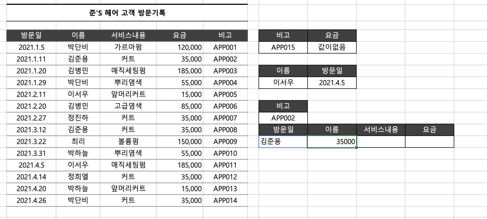


### ✅ UNIQUE, SORT 함수

| 함수 | 기본 구조 | 기능 |
| --- | --- | --- |
| `UNIQUE` | `=UNIQUE(배열)` | 범위에서 중복을 제외한 고유 값을 반환함 |
| `SORT` | `=SORT(배열, [정렬기준], [정렬순서], [정렬방향])` | 배열을 지정한 기준으로 정렬하여 반환함 |

- `UNIQUE`는 원본 데이터를 삭제하거나 변경하지 않고 고유 값 목록을 동적으로 생성함
- `SORT`의 정렬 순서는 `1`이면 오름차순, `-1`이면 내림차순임
- `SORT(UNIQUE(범위))`처럼 여러 동적 배열 함수를 중첩하여 사용 가능함
- 원본 데이터가 변경되면 결과 범위도 자동으로 갱신됨

> **다른 기능과 만나면 활용도가 배가 되는 UNIQUE, SORT 함수(399 ~ 402p)를 진행 후 인증사진을 첨부해주세요.**
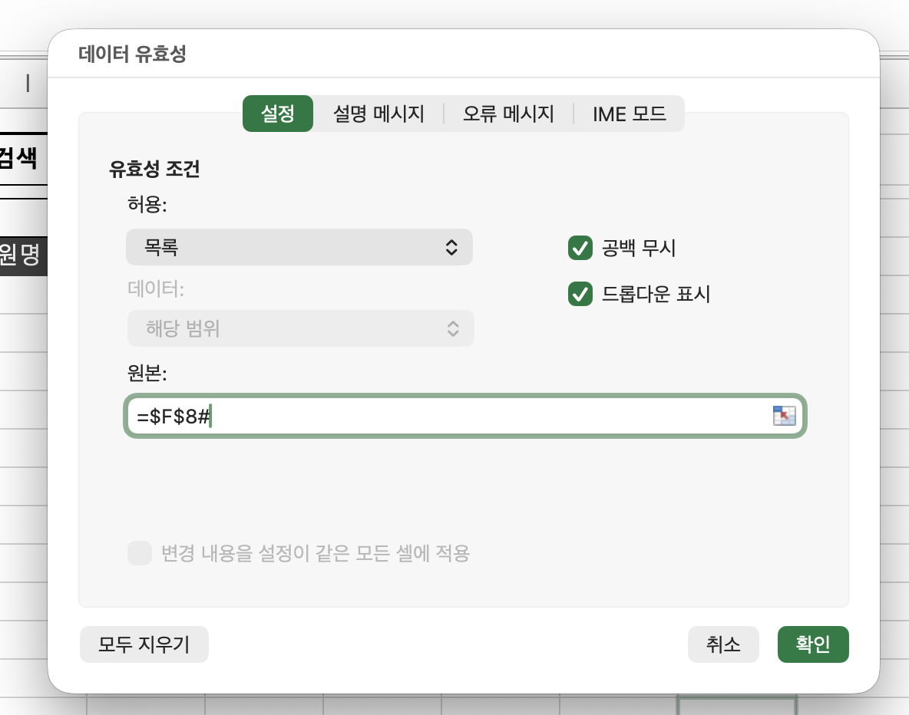
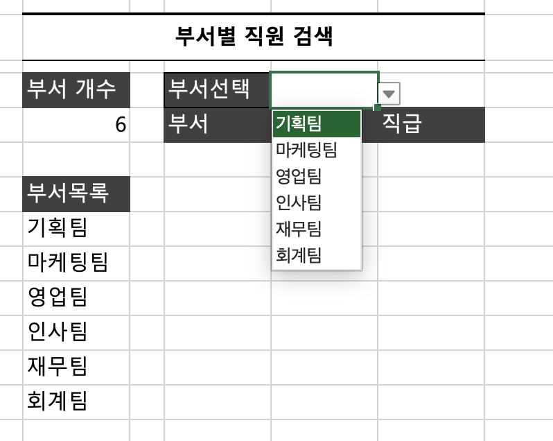
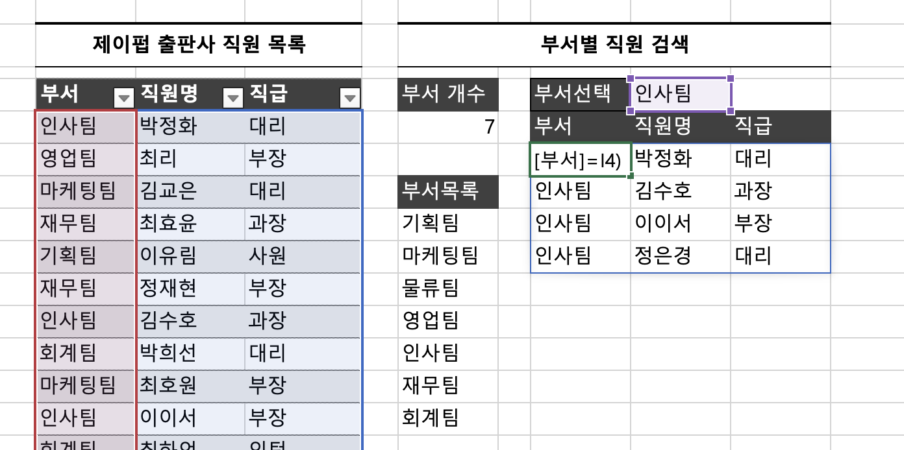


## 07-5. 실무에서 발생하는 어려움을 해결하는 필수 함수 공식

### 📌 다중 조건 IF 함수

여러 조건을 동시에 판단하려면 `IF` 함수 안에 `AND` 또는 `OR` 함수를 함께 사용함

| 함수 | 조건 판단 |
| --- | --- |
| `AND` | 모든 조건이 `TRUE`일 때만 `TRUE`를 반환함 |
| `OR` | 조건 중 하나 이상이 `TRUE`이면 `TRUE`를 반환함 |

```text
=IF(AND(조건1, 조건2), 참일 때 결과, 거짓일 때 결과)

=IF(OR(조건1, 조건2), 참일 때 결과, 거짓일 때 결과)
```

### AND / OR 결과 비교

| 조건1 | 조건2 | `AND` | `OR` |
| --- | --- | --- | --- |
| TRUE | TRUE | TRUE | TRUE |
| TRUE | FALSE | FALSE | TRUE |
| FALSE | TRUE | FALSE | TRUE |
| FALSE | FALSE | FALSE | FALSE |

📌 여러 단계의 결과를 구분할 경우 `IF` 함수 안에 또 다른 `IF` 함수를 중첩하여 사용할 수 있음

> **여러 조건을 비교해서 결과 출력하기, 다중 조건 IF 함수(403 ~ 407p)를 진행 후 인증사진을 첨부해주세요.**
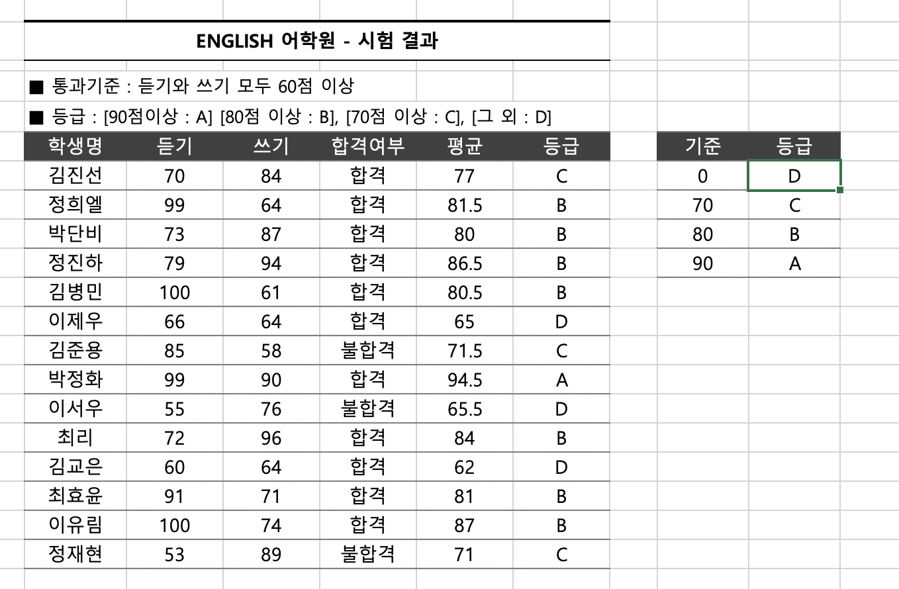


### ✅ ISNUMBER + SEARCH 함수

| 함수 | 기본 구조 | 기능 |
| --- | --- | --- |
| `SEARCH` | `=SEARCH(찾을문자, 대상문자열)` | 찾는 문자의 시작 위치를 숫자로 반환함 |
| `ISNUMBER` | `=ISNUMBER(값)` | 값이 숫자인지 확인하여 `TRUE/FALSE`를 반환함 |

```text
=ISNUMBER(SEARCH("찾을문자", 셀))
```

- `SEARCH`에서 문자를 찾으면 숫자 위치값이 반환되므로 `ISNUMBER`의 결과가 `TRUE`가 됨
- 문자를 찾지 못하면 `SEARCH`에서 오류가 발생하며 `ISNUMBER` 결과는 `FALSE`가 됨
- 특정 단어의 포함 여부를 조건으로 사용해야 할 때 활용 가능함

> **단어의 포함 여부를 검색하는 ISNUMBER, SEARCH 함수 공식(407 ~ 411p)를 진행 후 인증사진을 첨부해주세요.**
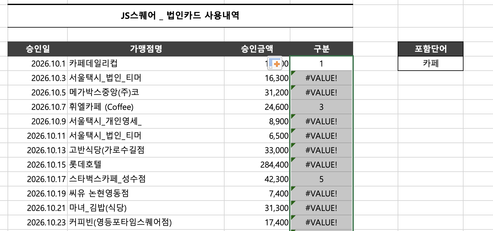
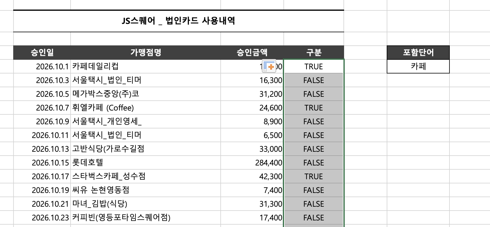
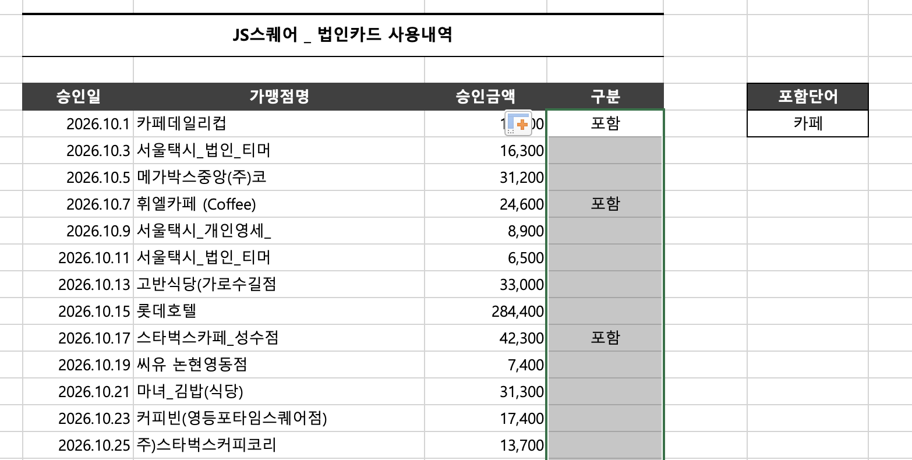


### 📌 INDEX / MATCH 함수

| 함수 | 기본 구조 | 기능 |
| --- | --- | --- |
| `INDEX` | `=INDEX(범위, 행번호, [열번호])` | 지정한 행·열 위치의 값을 반환함 |
| `MATCH` | `=MATCH(찾을값, 찾을범위, 일치방식)` | 찾을 값이 범위에서 몇 번째 위치에 있는지 반환함 |

```text
=INDEX(결과범위, MATCH(찾을값, 기준범위, 0))
```

- `MATCH`의 일치 방식에 `0`을 사용하면 정확히 일치하는 값의 위치를 반환함
- `MATCH`로 위치를 찾고 `INDEX`로 해당 위치의 값을 반환하는 방식임
- VLOOKUP과 달리 찾는 열의 왼쪽에 있는 값도 조회 가능함
- 열을 삽입하거나 삭제해도 고정된 열 번호를 사용하는 VLOOKUP보다 영향을 적게 받음

> **VLOOKUP 함수의 단점을 해결해 주는 INDEX/MATCH 함수 공식(412 ~ 415p)를 진행 후 인증사진을 첨부해주세요.**
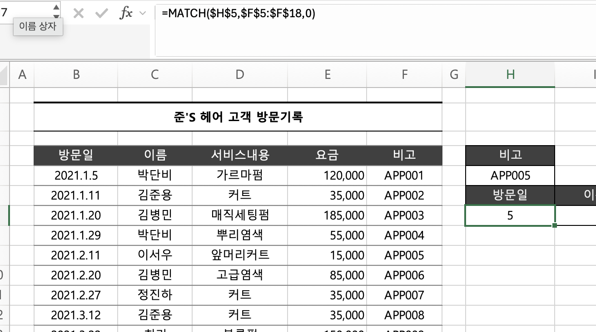
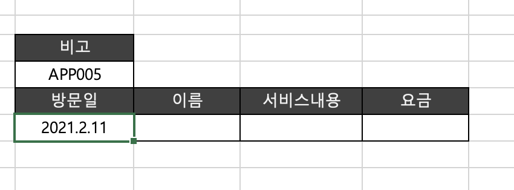
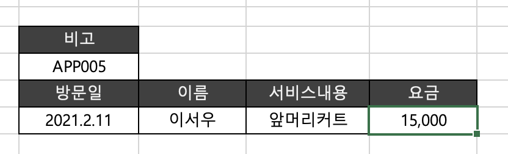


### ✅ 여러 조건을 만족하는 값 검색

여러 조건의 비교 결과를 곱해 모든 조건을 만족하는 행을 `1`로 만든 뒤 `MATCH`와 `INDEX`로 결과를 반환하는 방식임

```text
=INDEX(결과범위, MATCH(1, (조건범위1=조건1)*(조건범위2=조건2), 0))
```

| 부분 | 의미 |
| --- | --- |
| `(조건범위1=조건1)` | 첫 번째 조건의 일치 여부를 `TRUE/FALSE`로 반환함 |
| `(조건범위2=조건2)` | 두 번째 조건의 일치 여부를 `TRUE/FALSE`로 반환함 |
| `*` | 두 조건이 모두 참인 행만 `1`이 되도록 결합함 |
| `MATCH(1, ..., 0)` | 두 조건을 모두 만족하는 행의 위치를 찾음 |
| `INDEX` | 찾은 위치의 최종 결과값을 반환함 |

⚠️ 엑셀 버전에 따라 배열 수식 입력 방식이 다를 수 있으며 구버전에서는 `Ctrl + Shift + Enter`가 필요할 수 있음

> **여러 조건을 만족하는 결과 겁색하기, VLOOKUP 다중 조건 공식(415 ~ 417p)를 진행 후 인증사진을 첨부해주세요.**
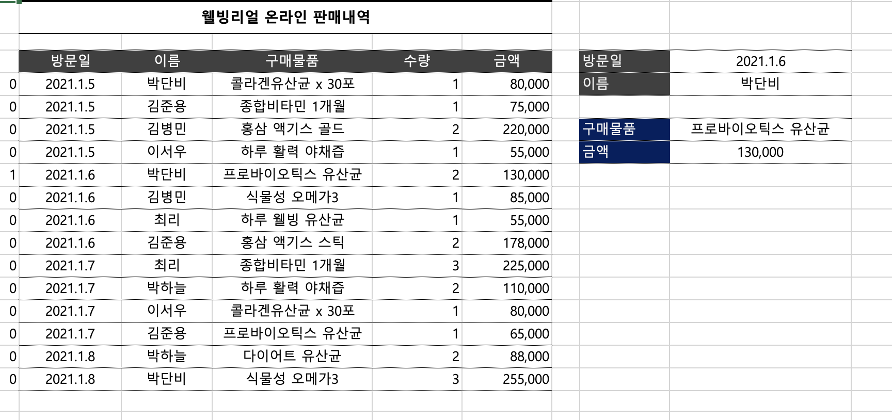


---


### 🎉 수고하셨습니다.
